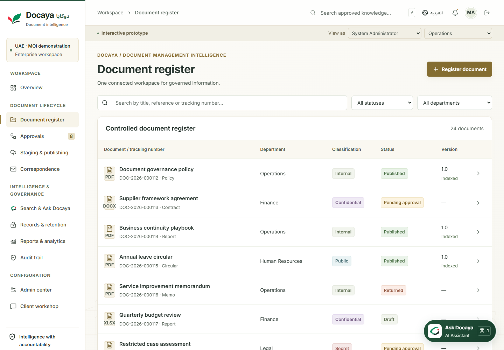

# Docaya | دوكايا

**Document Management Intelligence · ذكاء إدارة الوثائق**

An interactive English/Arabic document management prototype for UAE Ministry of Interior client workshops. Explore document capture, approvals, publishing, discovery, records governance and administration with synthetic MOI scenarios.

**[Open the live demo](https://hypermine2050.github.io/Docaya-Pro/)** · [Client demonstration guide](docs/prototype-demo.md) · [Architecture](docs/architecture.md)

<a href="public/brand/docaya-welcome.png"></a>

Select **Enter demo workspace** and use **System Administrator** to explore all modules. Switch language to demonstrate Arabic and right-to-left layouts.

> This is a browser-based UI/UX prototype. Sample records and identities are fictional; AI, authentication and external integrations are simulated. No backend, Azure account, credentials or `.env` file is required to run it.

## Approved branding

The application uses the following selected images consistently across the login screen and workspace:

| Identity          | Selected image                                                                     | Application placement                                                                             |
| ----------------- | ---------------------------------------------------------------------------------- | ------------------------------------------------------------------------------------------------- |
| **Docaya**        | [Emerald D folder with documents and UAE skyline](public/brand/docaya-welcome.png) | Full artwork on login, a compact 60 px view in the top-left corner, favicon and Apple touch icon. |
| **Ask Docaya AI** | [D speech bubble with white sparkle](public/brand/ask-docaya-mark.png)             | Assistant launcher, panel, responses, search and discovery.                                       |

See the [login screenshot](docs/images/docaya-login.png), [brand guide](docs/branding.md) and [latest release notes](docs/release-notes.md). Earlier logo explorations remain in the repository as reference assets.

## Latest experience

| Area                       | What you can demonstrate                                                                                                       |
| -------------------------- | ------------------------------------------------------------------------------------------------------------------------------ |
| Document registration      | Upload an original or choose a sample, review its preview and complete Capture, Classify and Review & submit.                  |
| Automatic classification   | Inspect local suggestions and their rationale, override fields and explicitly confirm classification in the registration form. |
| Approval queue             | Scan pending documents by due date, open a focused review drawer, approve or return with a reason, and continue explicitly.    |
| Search & Ask Docaya        | Browse document thumbnails or a list, filter results, save queries and open cited records.                                     |
| Docaya AI Assistant        | Open the floating bottom-right assistant, inspect source thumbnails and provide response feedback.                             |
| UAE design and readability | Selected 3D emerald D Docaya identity and D speech-bubble AI logo, UAE-inspired colours, bundled Inter and Noto Sans Arabic.   |
| Governance and workshops   | Explore holds, retention, correspondence, reports, audit history and M1–M15 coverage; record and export client expectations.   |




**Approvals** opens a full-width **To review** list containing pending documents only, with the earliest due first. Search documents or select **Overdue only**; **Returned** is a separate view for documents awaiting owner changes. Registration remains available from the document register.

Opening a document changes the desktop list to a compact queue beside its preview and **Review**, **Details** and **Activity** tabs. One **Approve & sign** action and one **Return for changes** action keep the decision clear. Returning requires an explanation and **Confirm return**; **Cancel** leaves the document unchanged. Feedback explains the saved decision, and **Next pending document** stays within the filtered queue. Partial approvals require **Review the remaining step** before another decision. The app does not automatically approve or advance.

The review drawer has no blurred backdrop. On narrow screens the content stacks; closing the drawer returns to the queue. The assistant is hidden while an approval drawer is open so it cannot cover the decision controls. Other document-management screens retain their existing overview, workflow, governance and activity tabs.

## Run locally

Prerequisites: **Node.js 22.13–26** and **npm 10–11**. Run these commands from the repository root:

```powershell
npm ci
npm start -- --strictPort
```

Open **[http://localhost:5173/](http://localhost:5173/)** and select **Enter demo workspace**. Keep the terminal running; press `Ctrl+C` to stop the server.

If port 5173 is already occupied, use another port:

```powershell
npm start -- --port 5175 --strictPort
```

Then open **http://localhost:5175/**. Use `Ctrl+F5` if the browser shows older assets after an update. The language toggle changes English/Arabic; `Ctrl+J` on Windows or `Cmd+J` on macOS toggles the assistant when it is available in the workspace, outside an approval or registration drawer.

## Client demo route

1. **Overview and document register:** introduce Docaya, synthetic MOI records and Arabic layout.
2. **Register document:** choose a traffic, civil defence or evidence sample; inspect classification, override a field and confirm your review.
3. **Approvals → To review:** scan due dates, open a document, approve or confirm a return with a reason, then choose the next pending document. Use **Returned** to inspect owner feedback.
4. **Staging & publishing → Search indexing → Run demo batch:** index published records, then demonstrate thumbnail search and the floating assistant.
5. **Records & retention, Correspondence and Client workshop:** demonstrate governance scenarios and capture the client's expectations; export workshop notes to CSV.

The [detailed demonstration guide](docs/prototype-demo.md) includes a fifteen-minute walkthrough, preview behavior and the implemented/future scope for all fifteen modules.

## Data and prototype boundaries

- **Local workspace:** documents, settings and workshop notes persist in localStorage; uploaded originals are stored in IndexedDB. Localhost and the hosted site have separate workspaces. Git pushes and deployments do not synchronize browser data.
- **Uploads:** PDF, DOCX, XLSX, PPTX, PNG, JPEG, TIFF and TXT, up to 20 MB per file. Hashing, basic file-header checks and duplicate detection are demonstrated; these are not malware or DLP scanning.
- **Classification:** local rules inspect filenames and up to the first 12,000 characters of TXT files. Suggestions are editable, and confidence indicates a rule score. There is no PDF/Office text extraction, image OCR or model inference.
- **Discovery:** retrieval matches registered metadata and summaries from accessible, published and indexed records. Answers cite those records. It does not search the full contents of arbitrary uploads or call a live LLM.
- **Previews:** supported images, TXT and browser-supported PDF originals can be previewed. Office files and PDF thumbnails use covers. Seeded documents use marked sample previews and downloadable sample text.
- **Integrations:** identity, signatures, publishing destinations, notifications and correspondence demonstrate local state transitions. Browser role controls are not production authorization, and no external message is sent.
- **Reset:** export workshop notes before resetting demo data. Reset removes this prototype's local records, uploaded originals and notes and restores the sample workspace.

## Validate changes

```powershell
npm run build
npm run lint
npm test
npm run test:e2e
```

The prototype browser journeys cover classification, pending queue ordering and filters, approval and return decisions, search, governance, correspondence, administration and Arabic accessibility. The local configuration uses installed Chrome; CI installs Chromium. See [playwright.prototype.config.ts](playwright.prototype.config.ts).

To run those browser journeys against the hosted build:

```powershell
npx cross-env DOCAYA_E2E_URL=https://hypermine2050.github.io/Docaya-Pro/ npm run test:e2e
```

The latest UI revision was also checked for loaded bilingual fonts, desktop/mobile layout, review and registration drawers, and automated accessibility findings. These checks support prototype quality; they do not establish production compliance.

## Publish to GitHub Pages

Canonical repository: **[hypermine2050/Docaya-Pro](https://github.com/hypermine2050/Docaya-Pro)**.

Git remote `origin` should point to:

```powershell
https://github.com/hypermine2050/Docaya-Pro.git
```

The hosted demo URL is **[https://hypermine2050.github.io/Docaya-Pro/](https://hypermine2050.github.io/Docaya-Pro/)**.

Push changes to **`main`**. [Prototype quality](.github/workflows/ci.yml) runs first; after a successful push run, [Publish prototype to GitHub Pages](.github/workflows/prototype-pages.yml) builds and deploys that exact tested commit. Pull-request runs do not publish. The build uses `/Docaya-Pro/` as its asset base and publishes only `dist/`.

Manual publishing is also available in GitHub Actions. A manual run builds the selected revision and does not require a preceding successful quality run, so complete validation first.

For a local production-build preview:

```powershell
npm run build
npm run preview -- --host localhost --port 4173 --strictPort
```

Open **http://localhost:4173/**. Each origin has independent demo data, including the production preview port.

## Documentation

| Document                                                                    | Purpose                                                                                               |
| --------------------------------------------------------------------------- | ----------------------------------------------------------------------------------------------------- |
| [Client demonstration guide](docs/prototype-demo.md)                        | Walkthrough, current functionality, typography, persistence and M1–M15 coverage.                      |
| [Release notes](docs/release-notes.md)                                      | Approved branding, current demo improvements and validation of the published application.             |
| [Brand assets and usage](docs/branding.md)                                  | Docaya and AI logo gallery, welcome artwork, palette, file links and presentation guidance.           |
| [Architecture](docs/architecture.md)                                        | Current browser implementation, source map, storage and publishing; retained connected-system design. |
| [Enterprise specification](<docs/Solution Doc/Docaya-DMS-Specification.md>) | Original enterprise requirements and engineering baseline, with a current prototype status note.      |
| [Threat model](docs/threat-model.md)                                        | Retained connected-application security design reference.                                             |
| [Operations runbook](docs/runbooks/operations.md)                           | Retained API and infrastructure operations reference.                                                 |
| [API contract](docs/api/openapi.json)                                       | Retained connected-application API contract.                                                          |

The default entry point is `src/main.tsx` → `src/prototype/PrototypeApp.tsx`. Earlier `src/App.tsx`, `server/` and infrastructure files remain in the repository as connected-application references; the prototype startup commands do not activate that application or its organizational sign-in.
