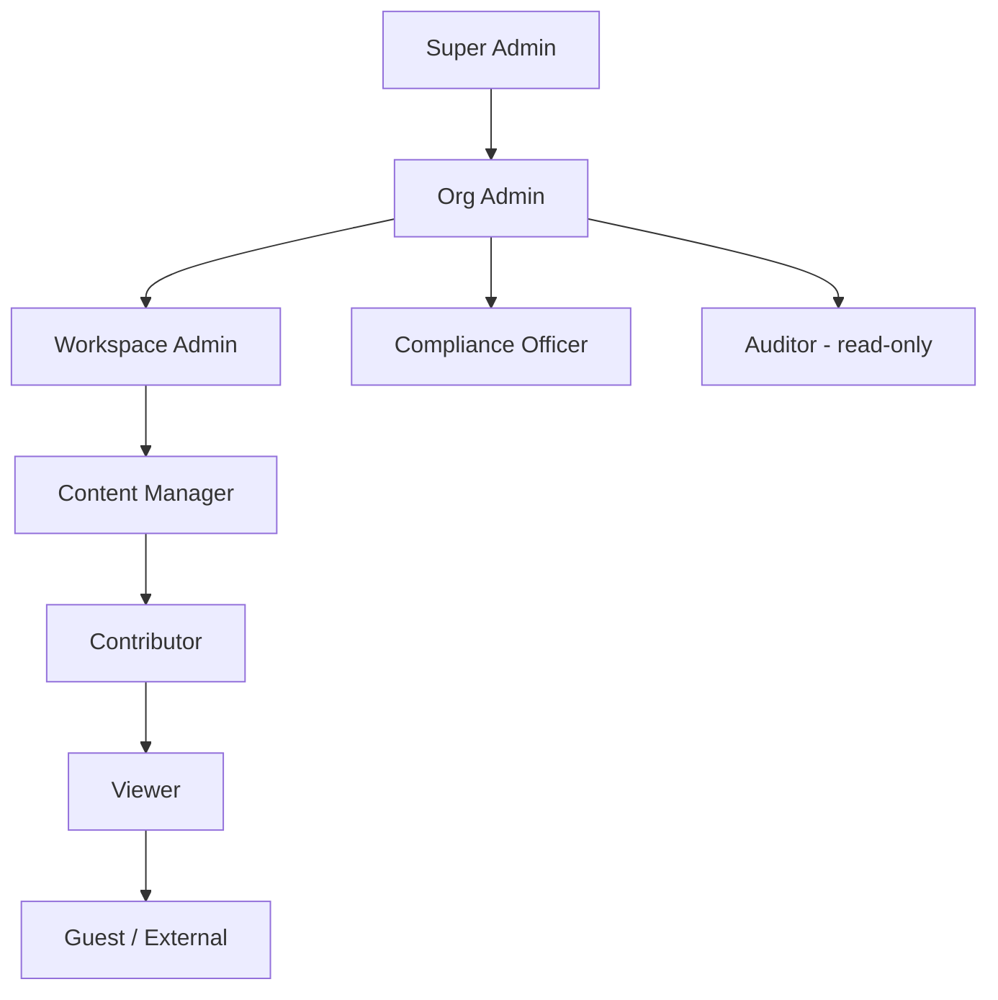
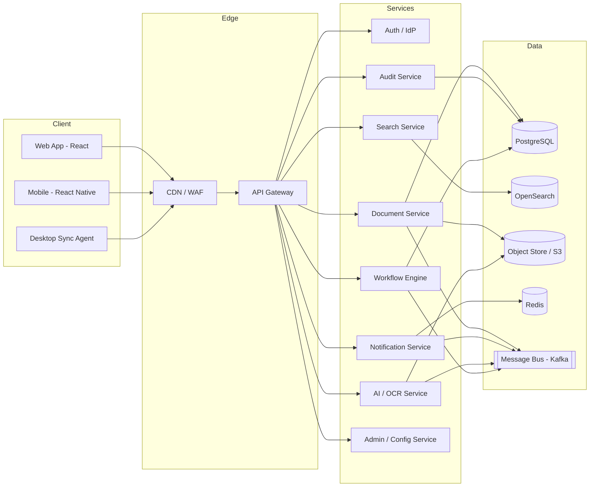
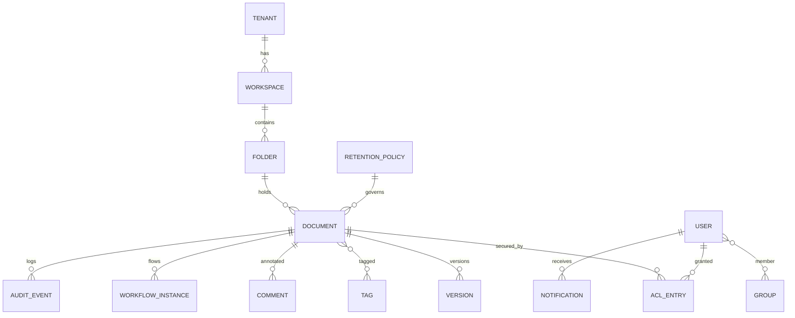
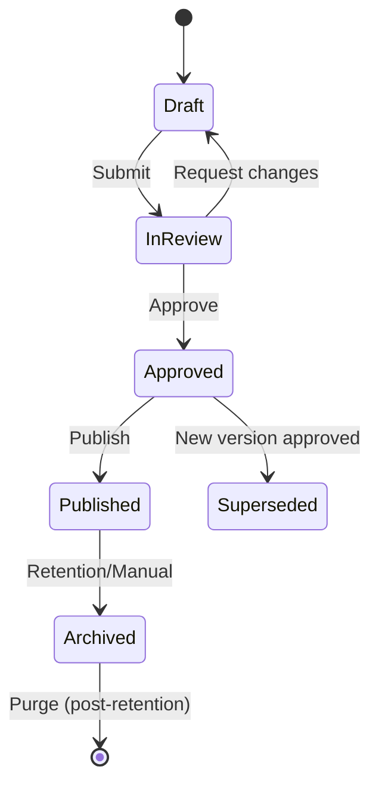
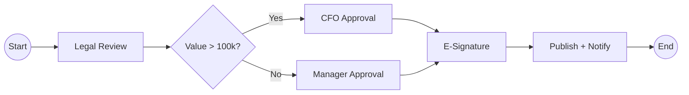
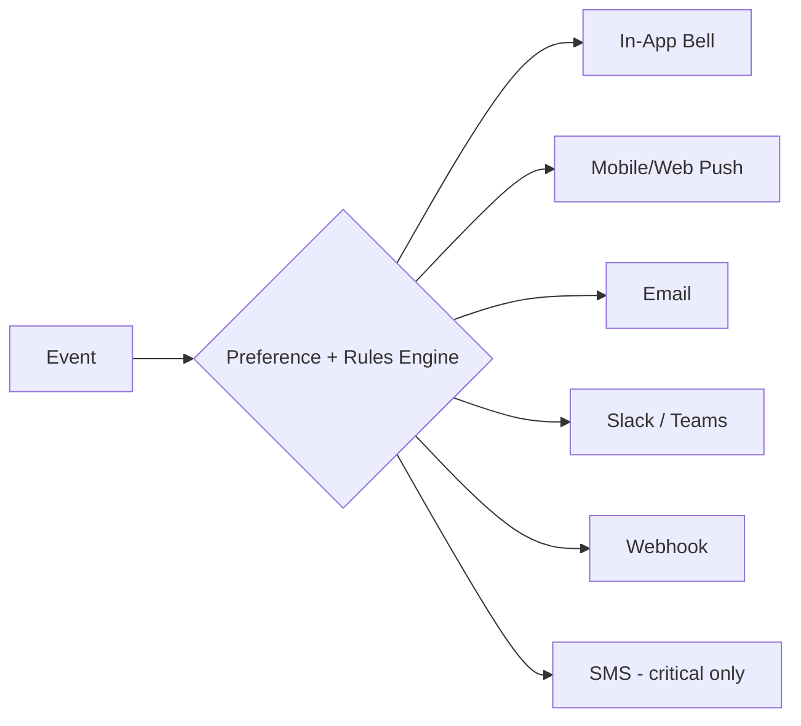
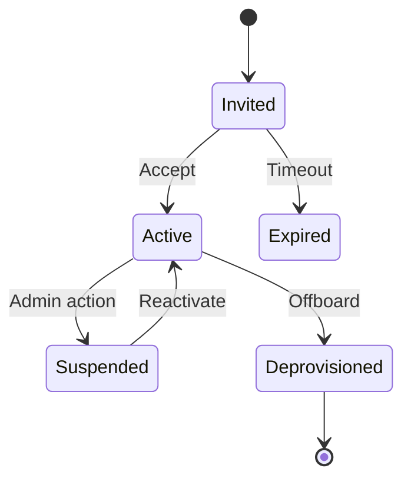
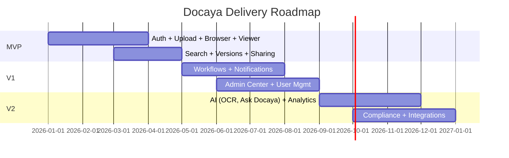

<!--
============================================================
  DOCAYA — DOCUMENT MANAGEMENT SYSTEM
  Master Design & Engineering Specification
  Version: 1.1.0
  Author: Ojashwa Chauhan (Information Management & Data)
  Status: Draft for Remediation and Build
  Last Updated: 2026-09-03
============================================================
  HOW TO USE THIS FILE IN VS CODE
  ------------------------------------------------------------
  1. Install the extensions listed in §21 (Markdown All in One,
     Mermaid Preview, Markdown Preview Enhanced).
  2. Press Ctrl/Cmd + Shift + V to open the live preview.
  3. Use the Outline panel (Explorer sidebar) to navigate the
     numbered sections below.
  4. Mermaid diagrams render inside "```mermaid" code fences.
  5. Treat every "MUST / SHOULD / MAY" as an RFC-2119 keyword.
-->

# 📁 Docaya — Document Management System

> **Tagline:** *"Every document. One home. Zero friction."*
> A secure, intelligent, enterprise-grade Document Management System (DMS) with best-in-class UX, granular access control, a real-time Notification Center, and a fully configurable Admin Center.

---

## 📑 Table of Contents

1. [Product Vision & Principles](#1-product-vision--principles)
2. [Personas & User Roles](#2-personas--user-roles)
3. [System Architecture](#3-system-architecture)
4. [Technology Stack](#4-technology-stack)
5. [Data Model & Schema](#5-data-model--schema)
6. [Core Feature Set](#6-core-feature-set)
7. [Document Lifecycle & Workflow Engine](#7-document-lifecycle--workflow-engine)
8. [Search, AI & Intelligence Layer](#8-search-ai--intelligence-layer)
9. [UI / UX Design System](#9-ui--ux-design-system)
10. [Screen-by-Screen Specification](#10-screen-by-screen-specification)
11. [Notification Center](#11-notification-center)
12. [Admin Center & Configuration](#12-admin-center--configuration)
13. [User Management](#13-user-management)
14. [Security, Compliance & Governance](#14-security-compliance--governance)
15. [API Design](#15-api-design)
16. [Integrations](#16-integrations)
17. [Analytics & Reporting](#17-analytics--reporting)
18. [Non-Functional Requirements](#18-non-functional-requirements)
19. [Accessibility & Internationalization](#19-accessibility--internationalization)
20. [DevOps, Testing & Deployment](#20-devops-testing--deployment)
21. [Appendices](#21-appendices)
22. [Implementation Baseline & Remediation Requirements](#22-implementation-baseline--remediation-requirements)

---

## 1. Product Vision & Principles

### 1.1 Vision
Docaya is the single source of truth for all organizational documents — from a signed contract to a napkin sketch. It combines **enterprise governance** (retention, audit, e-signature, compliance) with **consumer-grade delight** (instant search, drag-and-drop, real-time collaboration).

### 1.2 Design Principles

| # | Principle | What it means in practice |
|---|-----------|---------------------------|
| P1 | **Zero-friction capture** | Any file, from any device, in ≤ 2 clicks. Drag-drop, email-in, scan, mobile capture, API. |
| P2 | **Findability first** | If it takes more than 3 seconds to find a doc, we failed. Full-text + semantic + metadata search. |
| P3 | **Secure by default** | Least-privilege, encrypted everywhere, every action audited. |
| P4 | **Progressive disclosure** | Simple for the 90%, powerful for the 10%. Advanced controls are discoverable, not in your face. |
| P5 | **Explainable automation** | AI suggests; humans decide. Every auto-action is logged and reversible. |
| P6 | **Accessible to all** | WCAG 2.2 AA is the floor, not the ceiling. |
| P7 | **Offline-tolerant** | View, edit and queue actions without a connection; sync on reconnect. |

### 1.3 Success Metrics (North Star)

- **Time-to-find** median < 3s
- **Time-to-upload** (single file) < 5s
- **Search success rate** > 95% (query → click within top 5)
- **Adoption**: > 80% weekly active among licensed users at 90 days
- **NPS** > 45

---

## 2. Personas & User Roles

### 2.1 Personas

| Persona | Goal | Pain today | Docaya delivers |
|---------|------|------------|-----------------|
| **Maya — Knowledge Worker** | Store & retrieve daily docs fast | Files scattered across email, drives, chat | Universal inbox + instant search |
| **Raj — Team Lead / Approver** | Review & approve, track versions | Endless email chains, "which is final?" | Workflow + version pinning |
| **Sara — Compliance Officer** | Retention, audit, legal hold | No visibility, manual audits | Immutable audit log + retention engine |
| **Omar — System Admin** | Configure, provision, secure | Rigid tools, ticket backlog | Self-serve Admin Center |
| **Lena — External Partner** | Access shared docs only | Insecure email attachments | Scoped, expiring secure links |

### 2.2 Role Hierarchy (RBAC + ABAC)



### 2.3 Permission Matrix (excerpt)

| Capability | Super Admin | Org Admin | WS Admin | Content Mgr | Contributor | Viewer | Guest |
|------------|:-----------:|:---------:|:--------:|:-----------:|:-----------:|:------:|:-----:|
| Configure tenant | ✅ | ⚙️ | ❌ | ❌ | ❌ | ❌ | ❌ |
| Manage users | ✅ | ✅ | ⚙️ | ❌ | ❌ | ❌ | ❌ |
| Create workspace | ✅ | ✅ | ❌ | ❌ | ❌ | ❌ | ❌ |
| Upload / edit | ✅ | ✅ | ✅ | ✅ | ✅ | ❌ | ❌ |
| Delete (soft) | ✅ | ✅ | ✅ | ✅ | ⚠️own | ❌ | ❌ |
| Purge (hard) | ✅ | ✅ | ❌ | ❌ | ❌ | ❌ | ❌ |
| Approve workflow | ✅ | ✅ | ✅ | ✅ | ❌ | ❌ | ❌ |
| Share externally | ✅ | ✅ | ✅ | ⚙️ | ⚙️ | ❌ | ❌ |
| View audit log | ✅ | ✅ | ⚙️ | ❌ | ❌ | ❌ | ❌ |
| Manage retention | ✅ | ✅ | ❌ | ❌ | ❌ | ❌ | ❌ |

> Legend: ✅ Full · ⚙️ Scoped/configurable · ⚠️ Conditional · ❌ Denied

---

## 3. System Architecture

### 3.1 High-Level Architecture



### 3.2 Architectural Tenets
- **Microservices** with a clear bounded-context per domain (Document, Workflow, Notification, Admin, Search, AI, Audit).
- **Event-driven**: every state change emits an event on the message bus (Kafka/NATS) for loose coupling and audit.
- **CQRS** where read/write asymmetry is high (search reads vs. document writes).
- **Stateless services** behind a gateway; all state in Postgres / object store / Redis.
- **Multi-tenant** with row-level security + per-tenant encryption keys.

### 3.3 Storage Strategy
- **Object storage** (S3-compatible) for binaries; content-addressed (SHA-256) for dedup.
- **Postgres** for metadata, ACLs, workflow state.
- **OpenSearch** for full-text + vector (semantic) search.
- **Redis** for sessions, presence, notification fan-out, rate limits.
- **Cold tier** (Glacier-class) for retention/archive with lifecycle policies.

---

## 4. Technology Stack

| Layer | Choice | Rationale |
|-------|--------|-----------|
| Web frontend | **React 18 + TypeScript + Vite** | Ecosystem, speed, type safety |
| UI framework | **Tailwind CSS + Radix UI / shadcn** | Accessible primitives, design tokens |
| State | **TanStack Query + Zustand** | Server cache + light client state |
| Mobile | **React Native (Expo)** | Shared logic, native capture |
| Backend | **Node.js (NestJS)** or **Go** for hot paths | DX + performance |
| API | **REST + GraphQL (BFF) + WebSocket** | Flexibility + real-time |
| DB | **PostgreSQL 16** | Reliability, RLS, JSONB |
| Search | **OpenSearch + pgvector** | Hybrid keyword + semantic |
| Object store | **MinIO / AWS S3** | Scalable binaries |
| Queue | **Kafka / NATS** | Event backbone |
| Cache | **Redis** | Sessions, presence |
| AI | **OCR (Tesseract/Textract), embeddings, LLM** | Extraction & semantic |
| Auth | **OIDC / SAML (Keycloak/Entra ID)** | SSO, MFA |
| Infra | **Kubernetes + Terraform** | Portable, IaC |
| Observability | **OpenTelemetry + Grafana + Loki** | Traces, metrics, logs |

---

## 5. Data Model & Schema

### 5.1 Core Entities (ERD)



### 5.2 Key Tables (abbreviated DDL)

```sql
-- Documents (metadata; binary lives in object store)
CREATE TABLE document (
  id             UUID PRIMARY KEY DEFAULT gen_random_uuid(),
  tenant_id      UUID NOT NULL,
  workspace_id   UUID NOT NULL,
  folder_id      UUID,
  title          TEXT NOT NULL,
  doc_type       TEXT,                -- contract, invoice, policy...
  status         TEXT DEFAULT 'draft',-- draft|review|approved|archived
  current_version_id UUID,
  content_hash   TEXT,                -- SHA-256, dedup
  mime_type      TEXT,
  size_bytes     BIGINT,
  metadata       JSONB DEFAULT '{}',  -- flexible, schema-per-doc-type
  retention_policy_id UUID,
  legal_hold     BOOLEAN DEFAULT false,
  created_by     UUID,
  created_at     TIMESTAMPTZ DEFAULT now(),
  updated_at     TIMESTAMPTZ DEFAULT now(),
  deleted_at     TIMESTAMPTZ          -- soft delete
);

-- Versions (immutable)
CREATE TABLE version (
  id           UUID PRIMARY KEY DEFAULT gen_random_uuid(),
  document_id  UUID NOT NULL REFERENCES document(id),
  version_no   INT NOT NULL,
  object_key   TEXT NOT NULL,        -- pointer into object store
  size_bytes   BIGINT,
  comment      TEXT,
  created_by   UUID,
  created_at   TIMESTAMPTZ DEFAULT now(),
  UNIQUE(document_id, version_no)
);

-- ACL (row-level, combined with RBAC + ABAC)
CREATE TABLE acl_entry (
  id           UUID PRIMARY KEY DEFAULT gen_random_uuid(),
  document_id  UUID,
  folder_id    UUID,                 -- inheritance source
  principal_id UUID NOT NULL,        -- user or group
  principal_type TEXT,               -- user|group
  permission   TEXT NOT NULL,        -- view|comment|edit|manage|owner
  inherited    BOOLEAN DEFAULT false,
  expires_at   TIMESTAMPTZ
);

-- Immutable audit log (append-only, hash-chained)
CREATE TABLE audit_event (
  id           BIGSERIAL PRIMARY KEY,
  tenant_id    UUID,
  actor_id     UUID,
  action       TEXT,                 -- view|download|edit|share|delete...
  object_type  TEXT,
  object_id    UUID,
  ip           INET,
  user_agent   TEXT,
  prev_hash    TEXT,                 -- chain for tamper-evidence
  hash         TEXT,
  detail       JSONB,
  created_at   TIMESTAMPTZ DEFAULT now()
);
```

### 5.3 Metadata Model
- **Doc-type schemas** are JSON-Schema definitions stored in config (e.g., `contract` requires `counterparty`, `effective_date`, `value`).
- Metadata is validated on save; UI renders **dynamic forms** from these schemas.
- Supports **computed fields**, **controlled vocabularies** (dropdowns), and **cross-field validation**.

---

## 6. Core Feature Set

### 6.1 Capture & Ingest
- 🖱️ **Drag-and-drop** single/bulk upload with progress + resumable (tus protocol).
- 📧 **Email-in**: every folder gets a unique inbound address (`folder+abc@in.docaya.io`).
- 📷 **Mobile scan** with edge-detection, deskew, multi-page → PDF.
- 🔗 **Import connectors**: Google Drive, OneDrive, Dropbox, SharePoint, box.
- 🤖 **Watch folders / API** for system-to-system ingest.
- 🧬 **Automatic dedup** via content hash with "link vs. copy" prompt.

### 6.2 Organize
- **Folders + Smart Folders** (saved queries that auto-populate).
- **Tags / Labels** (color-coded, hierarchical).
- **Collections** (cross-folder curated sets).
- **Doc-type templates** with mandatory metadata.
- **Bulk operations**: move, tag, share, classify, delete.

### 6.3 View & Preview
- **Universal viewer** for 100+ formats (PDF, Office, images, CAD, video, code) with no download.
- **Page thumbnails**, zoom, rotate, full-text highlight of search hits.
- **Side-by-side version compare** (redline diff for text/Office).
- **Annotations**: highlight, sticky notes, stamps, freehand, @mentions.

### 6.4 Collaborate
- **Real-time co-annotation** with presence avatars.
- **Threaded comments** with resolve/reopen.
- **@mentions** trigger notifications + optional email.
- **Tasks** assignable on a document ("Review by Fri").
- **Share**: internal (by user/group) or **secure external links** (expiry, password, watermark, download toggle, view limits).

### 6.5 Version & Records
- **Auto-versioning** on every save; immutable history.
- **Pin "final"** version; **check-in / check-out** locking.
- **Rollback** to any prior version.
- **Records declaration** (freeze metadata + content for compliance).

### 6.6 Signatures
- **Native e-signature** (draw/type/upload) + integrations (DocuSign, Adobe Sign).
- **Signature workflows**: sequential/parallel signers, reminders, certificate of completion.

---

## 7. Document Lifecycle & Workflow Engine

### 7.1 Lifecycle States



### 7.2 Workflow Engine
A **no-code visual designer** (drag nodes) producing a JSON/BPMN-lite definition executed by the engine.

**Node types:**
- **Start / End**
- **Task** (assign to user/group/role)
- **Approval** (single, quorum, unanimous)
- **Condition** (if metadata.value > 100k → route to CFO)
- **Parallel / Join**
- **Delay / Timer** (SLA, escalation)
- **Action** (notify, tag, move, call webhook, generate PDF)

### 7.3 Example — Contract Approval



### 7.4 SLA & Escalation
- Each task has an **SLA timer**; on breach → escalate to manager + notify.
- **Delegation**: out-of-office auto-reassign.
- **Bulk approvals** from the Notification Center or email action buttons.

---

## 8. Search, AI & Intelligence Layer

### 8.1 Hybrid Search
- **Keyword (BM25)** + **semantic (vector)** fused via reciprocal-rank fusion.
- **Faceted filters**: type, owner, date, tag, workspace, status, size.
- **Query syntax**: `type:contract owner:me modified:<30d "force majeure"`.
- **Search-as-you-type** with instant suggestions and recent/saved searches.
- **In-document search** with hit highlighting.

### 8.2 AI Capabilities

| Feature | Description |
|---------|-------------|
| **OCR** | Extract text from scans/images; make searchable. |
| **Auto-classification** | Predict doc-type & route to correct folder. |
| **Auto-metadata extraction** | Pull counterparty, dates, amounts, IDs. |
| **Summarization** | One-click TL;DR of long documents. |
| **Semantic Q&A** | "Ask Docaya" — chat over your document corpus with cited sources. |
| **Similar documents** | "More like this" recommendations. |
| **PII / sensitivity detection** | Auto-flag & optionally redact SSNs, cards, health data. |
| **Duplicate & near-duplicate detection** | Reduce clutter. |
| **Translation** | On-the-fly translate previews. |

### 8.3 "Ask Docaya" (RAG)
- Retrieval-augmented generation grounded **only** in documents the user is permitted to see (ACL-filtered retrieval).
- Every answer shows **source citations** with click-through to the exact page.
- **Guardrail:** never surfaces content the user lacks permission for.

---

## 9. UI / UX Design System

### 9.1 Design Language
**"Calm productivity"** — spacious, content-first, low chrome, high signal. Inspired by the clarity of Linear, the depth of Notion, and the trust of enterprise tools.

### 9.2 Design Tokens

```jsonc
{
  "color": {
    "brand": { "primary": "#3B5BFF", "primaryHover": "#2E49D6", "accent": "#00C2A8" },
    "semantic": { "success": "#16A34A", "warning": "#F59E0B", "danger": "#DC2626", "info": "#2563EB" },
    "surface": { "bg": "#0B0D12", "card": "#151821", "elevated": "#1C2029" },  // dark
    "surfaceLight": { "bg": "#F7F8FA", "card": "#FFFFFF", "border": "#E5E7EB" }
  },
  "radius": { "sm": "6px", "md": "10px", "lg": "16px", "pill": "999px" },
  "spacing": [0, 4, 8, 12, 16, 24, 32, 48, 64],
  "shadow": {
    "sm": "0 1px 2px rgba(0,0,0,.06)",
    "md": "0 4px 12px rgba(0,0,0,.10)",
    "lg": "0 12px 32px rgba(0,0,0,.16)"
  },
  "font": {
    "family": "Inter, system-ui, sans-serif",
    "mono": "JetBrains Mono, monospace",
    "scale": { "xs": 12, "sm": 14, "base": 16, "lg": 18, "xl": 24, "2xl": 32, "3xl": 40 }
  },
  "motion": { "fast": "120ms", "base": "200ms", "slow": "320ms", "ease": "cubic-bezier(.2,.8,.2,1)" }
}
```

### 9.3 Theming
- **Light / Dark / System** + **high-contrast** mode.
- **Per-tenant white-label**: logo, primary color, custom domain, login backdrop.
- **Density toggle**: comfortable / compact.

### 9.4 Core Components (library)
Buttons · Inputs · Dynamic forms · Data table (sort/filter/resize/virtualize) · File cards · Breadcrumbs · Command palette (`⌘K`) · Toasts · Modals/Drawers · Tabs · Tree nav · Avatars/presence · Chips/tags · Progress · Empty states · Skeleton loaders · Context menus · Tooltips.

### 9.5 Interaction Patterns
- **Command palette (`⌘K`)** for everything: navigate, upload, share, run workflow.
- **Keyboard-first**: full shortcut map (see §21).
- **Drag-and-drop** everywhere (upload, move, reorder, into workflows).
- **Optimistic UI** with rollback on failure.
- **Inline everything**: rename, tag, comment without leaving context.
- **Undo** on destructive actions (5-second toast).

### 9.6 Layout Anatomy

```
┌───────────────────────────────────────────────────────────────┐
│  TopBar:  Logo  |  ⌘K Search........  |  🔔  ⚙️  Avatar         │
├────────────┬──────────────────────────────────┬───────────────┤
│  Left Nav  │        Main Content Area          │  Context Panel│
│  • Home    │   (list / grid / viewer)          │  (details,    │
│  • Recent  │                                    │   activity,   │
│  • Shared  │                                    │   comments)   │
│  • Tags    │                                    │               │
│  • Trash   │                                    │               │
│  Workspaces│                                    │               │
└────────────┴──────────────────────────────────┴───────────────┘
```

---

## 10. Screen-by-Screen Specification

### 10.1 Dashboard / Home
- **Personalized**: Recent, Pinned, Shared-with-me, Assigned tasks, Pending approvals.
- **Activity feed** (who did what).
- **Widgets** (configurable): storage usage, workflow queue, deadlines, quick-upload.

### 10.2 File Browser
- **Views**: List (dense metadata), Grid (thumbnails), Timeline.
- **Columns**: name, type, owner, modified, size, status, tags — user-configurable.
- **Bulk selection** + floating action bar.
- **Split-preview**: click a row → live preview in right panel without navigation.

### 10.3 Document Detail / Viewer
- Tabs: **Preview · Metadata · Versions · Comments · Activity · Permissions · Workflow**.
- Actions bar: download, share, sign, start workflow, tag, move, delete.
- Right rail: metadata form (dynamic), related docs, task list.

### 10.4 Upload Flow
1. Drop files → 2. Docaya suggests doc-type & metadata (AI) → 3. User confirms/edits → 4. Auto-classify to folder → 5. Success toast with quick-share.

### 10.5 Search Results
- Left: facets. Center: results with snippet + highlight + inline preview. Top: query chips.
- **Saved searches** become Smart Folders.

### 10.6 Empty & Error States
- Friendly illustrations, clear CTA ("Upload your first document"), never a dead end.

---

## 11. Notification Center

> The Notification Center is a **first-class product surface**, not an afterthought. It's the pulse of the user's work.

### 11.1 Goals
- Deliver the **right signal**, on the **right channel**, at the **right time**, with **zero noise**.

### 11.2 Notification Types

| Category | Examples |
|----------|----------|
| **Collaboration** | @mention, new comment, reply, task assigned |
| **Workflow** | Approval requested, approved/rejected, SLA breach, signature requested |
| **Document** | Shared with you, new version, someone downloaded, comment resolved |
| **Security** | New device login, permission changed, external share created |
| **Admin/System** | Storage limit, license expiry, policy update, maintenance |
| **Digest** | Daily/weekly summary rollups |

### 11.3 Channels & Routing



- **Smart batching** to prevent spam (e.g., "5 new comments on Contract X").
- **Do-Not-Disturb** windows + time-zone aware.
- **Priority levels**: critical (bypass DND), normal, low (digest only).
- **Deduplication** so the same event isn't delivered twice across channels.

### 11.4 In-App Notification Center UI
- **Bell icon** with unread badge (count + subtle pulse for critical).
- **Panel** (slide-over): grouped by Today / Earlier / This week.
- **Tabs**: All · Mentions · Approvals · System.
- Each item: avatar/icon, title, context snippet, timestamp, **inline actions** (Approve, Reply, Open, Dismiss).
- **Mark all read**, **filter**, **snooze**, **mute this thread/document**.
- **Real-time** via WebSocket; optimistic read-state sync across devices.

### 11.5 Per-User Preference Center
A granular matrix — for **every** notification type, choose channel(s):

```
                          In-App   Push   Email   Slack
@mention                    ●        ●       ○       ●
Approval requested          ●        ●       ●       ○
New version                 ●        ○       ○       ○
Weekly digest               ○        ○       ●       ○
Security alert (locked)     ●        ●       ●       ●
```
> ● on · ○ off · "locked" rows are mandatory (security) and non-editable.

### 11.6 Architecture
- **Notification Service** consumes domain events from the bus.
- **Rules/Preference engine** decides channel + timing per user.
- **Redis** for real-time fan-out + unread counts; **Postgres** for durable history.
- **Provider adapters**: email (SMTP/SendGrid), push (FCM/APNs), Slack/Teams, SMS (Twilio), webhook.
- **Idempotency keys** to guarantee exactly-once user-visible delivery.
- **Template system** (localized, brandable, with deep-links).

---

## 12. Admin Center & Configuration

> A **self-serve, no-code control plane**. Admins should never need a support ticket for routine configuration.

### 12.1 Admin Center Navigation

```
Admin Center
├── 📊 Overview (health, usage, licenses)
├── 👥 Users & Groups
├── 🔐 Roles & Permissions
├── 🏢 Workspaces
├── 🗂️ Document Types & Metadata Schemas
├── 🔄 Workflows
├── 🔔 Notification Templates & Policies
├── 📜 Retention & Legal Hold
├── 🛡️ Security & Compliance
├── 🎨 Branding & Theme
├── 🔌 Integrations & API Keys
├── 📈 Analytics & Reports
├── 🧾 Audit Log
└── ⚙️ System Settings
```

### 12.2 Configuration Capabilities

| Area | Configurable items |
|------|--------------------|
| **Doc types** | Create/edit types, define metadata fields, validation, required-ness, controlled vocab |
| **Workflows** | Visual builder, versioning, activate/deactivate, test-run sandbox |
| **Notifications** | Edit templates (per locale), default channel policies, org-wide mutes, quiet hours |
| **Retention** | Policies (time-based, event-based), disposition (delete/archive/review), legal holds |
| **Security** | Password policy, MFA enforcement, session timeout, IP allowlist, SSO config |
| **Branding** | Logo, colors, custom domain, email footer, login page |
| **Storage** | Quotas per workspace/user, storage tier rules, external storage mounts |
| **Sharing** | External share defaults (expiry, watermark, download), domain allowlist |
| **Integrations** | Connectors, webhooks, API keys, scopes, rate limits |

### 12.3 Admin Overview Dashboard
- Live tiles: **active users**, **storage used / quota**, **docs ingested (24h)**, **pending workflows**, **failed jobs**, **license seats used**.
- **Health status** of services (green/amber/red) with drill-down.
- **Recent admin actions** (config change log).

### 12.4 Doc-Type / Metadata Schema Builder (no-code)
- Drag field types: text, number, date, dropdown, multi-select, user-picker, currency, boolean, file-ref.
- Set validation (regex, min/max, required), default values, conditional visibility.
- **Preview** the generated form live before publishing.

### 12.5 Feature Flags & Rollout
- Toggle features per tenant/workspace/user cohort.
- **Gradual rollout** (%), A/B, kill-switch for risky features.

---

## 13. User Management

### 13.1 Provisioning
- **Manual** (invite by email), **bulk CSV import**, **SCIM 2.0** auto-provisioning, **JIT** from SSO.
- Invite → email → set password / SSO → onboarding checklist.

### 13.2 User Lifecycle



### 13.3 User Directory (Admin View)
- Searchable table: name, email, role, groups, workspaces, status, last active, MFA on/off, storage used.
- **Bulk actions**: assign role, add to group, suspend, reset password, force logout, export.
- **User detail**: profile, sessions (revoke), permissions (effective + inherited), activity, owned documents (reassign on offboard).

### 13.4 Groups & Teams
- Groups map to departments/projects; permissions granted to groups cascade.
- **Dynamic groups** by attribute rules (e.g., `department = Legal` → auto-membership).
- Nested groups supported.

### 13.5 Roles & Custom Roles
- Built-in roles (§2.2) + **custom roles** with a permission builder (pick capabilities).
- **ABAC overlays**: rules like "Contributors can share externally only for workspace = Marketing."

### 13.6 Offboarding (critical)
- One-click **deprovision**: revoke sessions, transfer document ownership, remove from groups, preserve audit trail, optional data export, license reclaim.
- **Retention of orphaned content** per policy (never silently deleted).

### 13.7 Authentication & Session
- **SSO** (OIDC/SAML), **MFA** (TOTP, WebAuthn/passkeys, SMS fallback).
- **Adaptive auth**: step-up MFA for sensitive actions (external share, purge).
- Session policies: idle + absolute timeout, concurrent-session limits, device trust.

---

## 14. Security, Compliance & Governance

### 14.1 Security Controls
- **Encryption**: TLS 1.3 in transit; AES-256 at rest; **per-tenant keys** (BYOK/HSM optional).
- **Least-privilege** RBAC + ABAC; deny-by-default.
- **Zero-trust** service mesh (mTLS between services).
- **Secrets** in vault; no secrets in code/env dumps.
- **WAF + rate limiting + bot protection** at edge.
- **Malware scanning** on every upload (ClamAV/av-vendor) before storage commit.
- **DLP**: block/flag uploads containing detected sensitive patterns.

### 14.2 Audit & Tamper-Evidence
- **Every action** (view, download, edit, share, permission change, login) logged.
- **Hash-chained** audit records → tamper-evident.
- **Immutable** (WORM) export to cold storage for legal.
- Searchable, filterable audit explorer in Admin Center.

### 14.3 Compliance Frameworks (design-for)
- **GDPR / DPDP** (data subject requests, right-to-erasure workflow, consent).
- **SOC 2 Type II**, **ISO 27001**, **HIPAA** (BAA-ready), **21 CFR Part 11** (e-sign records).
- **Data residency**: pin tenant data to a region.

### 14.4 Retention & Legal Hold
- **Retention policies**: time-based ("7 years after close") or event-based.
- **Disposition**: auto-archive, review-then-delete, or permanent delete with approval.
- **Legal hold** overrides retention — freezes documents, blocks deletion, audited.

### 14.5 Data Privacy
- **PII detection & redaction** (auto + manual).
- **Right-to-be-forgotten** workflow with verifiable erasure + certificate.
- **Consent & purpose tracking** per data category.

---

## 15. API Design

### 15.1 Principles
- **REST** for CRUD, **GraphQL** BFF for composite reads, **WebSocket** for real-time.
- **Versioned** (`/api/v1`), **OpenAPI 3.1** spec, **idempotency keys** on writes.
- **OAuth 2.0 / OIDC** bearer tokens; **scoped API keys** for machines.
- **Pagination** (cursor), **rate limits** (per key), **consistent error envelope**.

### 15.2 Sample Endpoints

```http
POST   /api/v1/documents                # create (multipart or presigned)
GET    /api/v1/documents/{id}           # metadata
GET    /api/v1/documents/{id}/content   # download (signed URL)
POST   /api/v1/documents/{id}/versions  # new version
GET    /api/v1/documents/{id}/versions  # history
PATCH  /api/v1/documents/{id}           # update metadata
POST   /api/v1/documents/{id}/share     # create share link
POST   /api/v1/search                   # hybrid search (body: query, filters)
POST   /api/v1/workflows/{id}/start     # kick off workflow
GET    /api/v1/notifications            # list (cursor paginated)
POST   /api/v1/notifications/read       # bulk mark read
POST   /api/v1/webhooks                 # register webhook
```

### 15.3 Error Envelope

```json
{
  "error": {
    "code": "PERMISSION_DENIED",
    "message": "You do not have edit access to this document.",
    "requestId": "req_9f8a...",
    "docs": "https://developers.docaya.io/errors/PERMISSION_DENIED"
  }
}
```

### 15.4 Webhooks & Events
- Subscribe to events: `document.created`, `version.added`, `workflow.completed`, `share.accessed`, `notification.sent`.
- Signed payloads (HMAC), retry with backoff, delivery logs.

---

## 16. Integrations

| Category | Integrations |
|----------|--------------|
| **Storage** | Google Drive, OneDrive, SharePoint, Dropbox, Box, S3 |
| **Identity** | Entra ID (Azure AD), Okta, Google Workspace, Keycloak (SAML/OIDC/SCIM) |
| **Comms** | Slack, Microsoft Teams, Email |
| **E-Sign** | DocuSign, Adobe Acrobat Sign |
| **Productivity** | Office 365 online edit, Google Docs |
| **Automation** | Zapier, Make, Power Automate, native webhooks |
| **Data/BI** | Export to Power BI, Tableau; audit-log SIEM feed |
| **Dev** | REST/GraphQL SDKs (JS, Python), CLI |

- **Co-editing**: open Office/Google docs in-place, save back as new version.
- **Embed**: iframe-embeddable viewer + upload widget with scoped tokens.

---

## 17. Analytics & Reporting

### 17.1 Dashboards
- **Usage**: active users, uploads, searches, storage trends.
- **Content**: doc-type distribution, most-viewed, stale/unused docs.
- **Workflow**: cycle time, bottlenecks, SLA compliance, approval load per user.
- **Compliance**: docs under retention, upcoming dispositions, legal holds, access anomalies.

### 17.2 Reports
- Scheduled (email/export) — CSV/PDF/XLSX.
- **Custom report builder** (pick dimensions + metrics + filters).
- **Access reports** ("who accessed Contract X in last 90 days") for audits.

### 17.3 Anomaly Detection
- Flags unusual bulk downloads, off-hours access, mass permission changes → security notification.

---

## 18. Non-Functional Requirements

| Attribute | Target |
|-----------|--------|
| **Availability** | 99.9% (99.95% enterprise tier) |
| **Latency** | p95 page load < 1.5s; search < 400ms; upload start < 300ms |
| **Scale** | 10k+ concurrent users/tenant; 1B+ documents; 100TB+/tenant |
| **File size** | Up to 5 GB per file (resumable, chunked) |
| **Durability** | 11 nines (object store replication) |
| **RPO / RTO** | RPO ≤ 5 min; RTO ≤ 1 hr |
| **Backup** | Continuous + daily snapshots, cross-region |
| **Rate limits** | Configurable per API key / tenant |

---

## 19. Accessibility & Internationalization

### 19.1 Accessibility (WCAG 2.2 AA+)
- Full **keyboard navigation** + visible focus rings.
- **Screen-reader** semantics (ARIA), live regions for async updates.
- **Contrast** ≥ 4.5:1; high-contrast theme.
- **Reduced-motion** honoring `prefers-reduced-motion`.
- **Resizable** text to 200% without loss.
- **Captions/alt-text** prompts for media.

### 19.2 Internationalization
- **RTL** support (Arabic, Hebrew) — mirrored layouts.
- **i18n** all strings externalized; ICU message format (plurals, dates, numbers).
- **Locale-aware** dates, numbers, currency, time zones.
- **Machine translation** for document previews.
- Ships with: English, Arabic, French, Spanish, German, Hindi, Chinese (extensible).

---

## 20. DevOps, Testing & Deployment

### 20.1 CI/CD
- Trunk-based; PR → automated checks → preview env → merge → progressive deploy.
- **Pipeline gates**: lint, type-check, unit, integration, e2e, security scan (SAST/DAST/SCA), a11y test.
- **Blue-green / canary** deploys with automatic rollback on SLO breach.

### 20.2 Testing Strategy

| Layer | Tooling / Coverage |
|-------|--------------------|
| Unit | Vitest/Jest — 80%+ core logic |
| Integration | Service + DB contract tests |
| E2E | Playwright — critical journeys |
| Load | k6 — search, upload, concurrent users |
| Security | OWASP ZAP, Snyk, Trivy |
| Accessibility | axe-core, manual SR passes |
| Chaos | Fault injection on key services |

### 20.3 Environments
`local → dev → staging (prod-like) → production`, each isolated, IaC-managed (Terraform), secrets via vault.

### 20.4 Observability & SRE
- **OpenTelemetry** traces across services; **Grafana** dashboards; **Loki** logs; **Prometheus** metrics.
- **SLOs + error budgets**; on-call runbooks; alerting to PagerDuty.
- **Synthetic monitoring** of critical flows.

### 20.5 Rollout Phases (suggested MVP → GA)



---

## 21. Appendices

### 21.1 Recommended VS Code Extensions
- **Markdown All in One** (yzhang.markdown-all-in-one)
- **Markdown Preview Enhanced** (shd101wyy.markdown-preview-enhanced)
- **Markdown Preview Mermaid Support** (bierner.markdown-mermaid)
- **Prettier**, **Code Spell Checker**, **Draw.io Integration**

### 21.2 Keyboard Shortcut Map (proposed)

| Action | Shortcut |
|--------|----------|
| Command palette | `⌘/Ctrl + K` |
| Global search | `/` |
| Upload | `U` |
| New folder | `⇧ + N` |
| Open notifications | `G then N` |
| Toggle preview panel | `P` |
| Move selected | `M` |
| Tag selected | `T` |
| Share | `S` |
| Next / Prev doc | `J / K` |
| Delete (soft) | `⌫` |

### 21.3 Glossary
- **ABAC** — Attribute-Based Access Control
- **ACL** — Access Control List
- **BFF** — Backend-for-Frontend
- **DLP** — Data Loss Prevention
- **RAG** — Retrieval-Augmented Generation
- **RLS** — Row-Level Security
- **SCIM** — System for Cross-domain Identity Management
- **WORM** — Write Once, Read Many

### 21.4 Open Questions / Decisions Log
| # | Question | Owner | Status |
|---|----------|-------|--------|
| 1 | Build native e-sign vs. integrate only? | Product | Open |
| 2 | Kafka vs. NATS for event bus | Eng | Open |
| 3 | Default data residency region | Compliance | Open |
| 4 | On-prem deployment option for V1? | Sales/Eng | Open |

### 21.5 Definition of Done (per feature)
- [ ] Meets acceptance criteria & design spec
- [ ] Unit + integration + e2e tests green
- [ ] Accessibility pass (axe + keyboard + SR)
- [ ] Security review (authz checks, input validation)
- [ ] Telemetry + audit events emitted
- [ ] Docs + API reference updated
- [ ] Feature flag + rollout plan

---

## 22. Implementation Baseline & Remediation Requirements

> **Document purpose:** This section records the implementation audit completed on 3 September 2026 and converts its findings into mandatory engineering requirements. The current codebase is a development prototype. It MUST NOT be represented as production-ready or fully compliant with this specification until every release blocker in this section is closed.

### 22.1 Current Implementation Baseline

The audited implementation currently contains:

- A React + TypeScript + Vite single-page frontend.
- A single Node.js HTTP server using `node:http`.
- SQLite metadata and workflow persistence under the local `data/` directory.
- Optional Microsoft Graph access to a SharePoint Online document library.
- Azure Bicep for Container Apps, PostgreSQL, Azure AI Search, Redis, Service Bus, Container Registry, Log Analytics, and Application Insights.
- A Docker multi-stage production build.

The following validation checks passed at audit time:

| Check | Result |
|---|---|
| TypeScript and Vite production build | Pass |
| Node.js syntax check | Pass |
| Bicep compilation | Pass |
| Production dependency vulnerability audit | Pass — zero known vulnerabilities |
| Local read-only API smoke checks | Pass |
| Live Container App provisioning state | Pass — `Succeeded` |
| Live Container Registry pull assignment | Pass — `AcrPull` present at registry scope |

The following validation checks did not pass:

| Check | Result / required action |
|---|---|
| Azure deployment validation | Failed because the validating identity lacked `Microsoft.Authorization/roleAssignments/write` for the declared role assignment. Use an authorized deployment identity or separate role-assignment deployment ownership. |
| Azure what-if | Failed for the same role-assignment authorization reason. A release MUST NOT proceed without a successful what-if review. |
| Private endpoint validation | Failed — no private endpoints were present although the infrastructure plan declares private connectivity. |
| Lint, unit, integration, E2E, accessibility, SAST, DAST, and container security gates | Not implemented. |

### 22.2 Required Repository Structure

The project MUST move from root-level monolith files to a domain-oriented structure. The target structure is:

```text
docaya/
├── .azure/                       # Deployment plans and validation evidence
├── .github/workflows/            # CI, security, preview, and release pipelines
├── docs/                         # ADRs, API reference, runbooks, and threat model
├── infra/
│   ├── main.bicep
│   ├── main.parameters.example.json
│   └── modules/
│       ├── container-app.bicep
│       ├── networking.bicep
│       ├── observability.bicep
│       ├── postgresql.bicep
│       ├── search.bicep
│       ├── redis.bicep
│       └── service-bus.bicep
├── src/
│   ├── app/                      # App shell, providers, routes, and startup
│   ├── components/               # Reusable accessible UI primitives
│   ├── features/
│   │   ├── admin/
│   │   ├── documents/
│   │   ├── notifications/
│   │   ├── search/
│   │   └── workflows/
│   ├── hooks/
│   ├── i18n/
│   ├── services/                 # Typed API client and integration adapters
│   ├── styles/                   # Tokens, themes, global styles
│   └── types/
├── server/
│   ├── app/                      # Server composition and lifecycle
│   ├── config/                   # Validated environment configuration
│   ├── db/
│   │   └── migrations/
│   ├── middleware/               # Auth, authorization, limits, errors, telemetry
│   ├── routes/                   # Versioned HTTP route modules
│   ├── services/                 # Document, workflow, audit, and Graph services
│   └── observability/
├── tests/
│   ├── unit/
│   ├── integration/
│   ├── e2e/
│   ├── accessibility/
│   └── load/
├── .editorconfig
├── .env.example
├── .gitignore
├── eslint.config.js
├── package.json
├── package-lock.json
├── README.md
└── tsconfig.json
```

Repository rules:

- Runtime databases, WAL/SHM files, environment files, logs, coverage, build output, and local tool state MUST be excluded in `.gitignore`.
- The `data/` directory MAY contain a committed `.gitkeep`, but MUST NOT contain committed operational or user data.
- Generated ARM JSON MUST NOT be committed unless an explicit release process requires it.
- `README.md` MUST document prerequisites, local startup, environment variables, test commands, architecture, and deployment workflow.
- Architectural decisions that change this specification MUST be recorded as ADRs under `docs/adr/`.

### 22.3 Authentication, Authorization, and API Security

The current unauthenticated API is a release blocker. Before any shared or production deployment:

- Every `/api` route except liveness and readiness endpoints MUST require a validated Entra ID OAuth 2.0/OIDC bearer token.
- Authorization MUST be deny-by-default and enforce the RBAC + ABAC model from §2 for every document, workflow, notification, audit, and admin operation.
- User identity and actor information MUST come from verified token claims; hard-coded users such as `You` or selection of the first database user are prohibited.
- Admin, audit, workflow-approval, delete, restore, and sharing operations MUST have explicit capability checks.
- CORS MUST use an environment-specific allowlist. Wildcard origins are prohibited for authenticated APIs.
- The server MUST apply request-body limits, rate limits, security headers, structured validation, and normalized error handling.
- Every request MUST receive a correlation/request ID. Error envelopes MUST follow §15.3 without exposing secrets or infrastructure details.
- Health responses MUST avoid disclosing tenant URLs, library names, credentials, or internal topology.
- State-changing endpoints MUST support idempotency keys where retrying could duplicate data or side effects.
- Audit records MUST include authenticated actor, action, object, timestamp, request ID, source IP, user agent, and outcome. Audit storage MUST become append-only and tamper-evident as defined in §14.2.

### 22.4 Document Upload and Content Safety

Base64 file content inside JSON MUST be removed. It cannot satisfy the 5 GB requirement and creates excessive browser and server memory use.

The replacement upload design MUST:

1. Create an upload session through an authenticated, authorized API call.
2. Stream or upload chunks directly to SharePoint Online or the approved object store.
3. Support resumable uploads, progress, cancellation, retry, and idempotent completion.
4. Enforce configured maximum size, extension, MIME signature, tenant quota, and filename rules on the server.
5. Quarantine every upload until malware scanning and DLP/classification checks complete.
6. Calculate a SHA-256 content hash for integrity and deduplication.
7. Commit metadata and emit audit/domain events only after storage completion.
8. Return accessible progress and error updates through an ARIA live region.

The UI MUST NOT display “up to 5 GB” until the complete chunked-upload flow is implemented and verified by load and interruption tests.

### 22.5 SharePoint and Microsoft Graph Integration

- The Graph client MUST use a single token-provider abstraction that supports both managed identity and approved local delegated development credentials.
- Document reads and writes MUST use the token-provider result, not the presence of `GRAPH_ACCESS_TOKEN`, to choose Graph mode.
- Production MUST use managed identity or another confidential workload identity. Long-lived delegated access tokens MUST NOT be stored in environment files.
- The configured SharePoint library MUST be resolved and verified by drive/library ID; code MUST NOT silently assume the site's default drive.
- Required Graph application permissions and tenant admin consent MUST be documented and verified during deployment.
- Graph failures MUST use bounded retry with backoff for retryable responses and MUST preserve correlation IDs.
- Local SQLite fallback MUST be explicitly enabled only for local development. Production startup MUST fail closed when its authoritative document store is unavailable or misconfigured.

### 22.6 Data and Persistence Requirements

- PostgreSQL 16 MUST be the authoritative store for metadata, users, ACLs, versions, workflows, notifications, and audit references outside local development.
- SQLite MAY be used only for isolated local development and tests. It MUST NOT be used by a scalable Container App revision.
- Database changes MUST use versioned migrations; runtime `CREATE TABLE` and ad-hoc `ALTER TABLE` operations are not an acceptable production migration strategy.
- The schema MUST implement tenant, workspace, folder, version, ACL, tag, comment, retention, and legal-hold relationships from §5.
- Foreign keys, uniqueness rules, status constraints, UTC timestamps, and transactional boundaries MUST be explicit.
- Document updates MUST return `404` when no record changes. Restore MUST only succeed for a document that is currently deleted.
- Metadata must store byte counts and timestamps as typed values rather than presentation strings such as `8.4 MB` or `Just now`.
- Seed data MUST run only in a deliberate development/test mode and MUST never overwrite production records on startup.

### 22.7 API Contract Requirements

- Public contracts MUST be versioned under `/api/v1`.
- An OpenAPI 3.1 document MUST be generated and validated in CI.
- Request and response types MUST be shared or generated for the frontend client.
- Collection endpoints MUST provide cursor pagination, deterministic ordering, filtering, and documented limits.
- All asynchronous UI calls MUST check HTTP status before parsing success payloads.
- Search requests MUST be debounced and cancel superseded requests to prevent stale results.
- Writes MUST validate allowed enum values, lengths, MIME types, identifiers, and ownership constraints.
- Unsupported methods MUST return `405 Method Not Allowed` with an `Allow` header.
- API contract tests MUST cover success, validation, unauthorized, forbidden, not-found, conflict, throttling, and dependency-failure behavior.

### 22.8 Frontend, Accessibility, and Internationalization

The frontend MUST meet WCAG 2.2 AA and §19 before release:

- Icon-only controls MUST have accessible names and visible tooltips where appropriate.
- Dialogs MUST use dialog semantics, labelled headings, focus trapping, initial focus, Escape-to-close, and focus restoration.
- Interactive table rows MUST be keyboard operable or contain semantic link/button controls.
- Form controls MUST have programmatic labels, descriptions, validation messages, and error focus handling.
- All interactive elements MUST have visible `:focus-visible` styles.
- Motion MUST honor `prefers-reduced-motion`.
- Async loading, upload progress, success, and errors MUST be announced through live regions.
- English and Arabic strings MUST be externalized into locale catalogs. Arabic mode MUST set `lang="ar"`, `dir="rtl"`, and mirror layout behavior.
- Dates, times, numbers, file sizes, and relative-time labels MUST be generated from real data using locale-aware formatters; hard-coded dates are prohibited.
- Dashboard statistics and governance claims MUST come from trusted APIs and MUST show loading/error states rather than static production-looking values.
- Automated axe checks and manual keyboard/screen-reader passes MUST be release gates.

### 22.9 Azure Infrastructure Corrections

The Bicep deployment MUST be corrected and revalidated as follows:

- Create private endpoints and private DNS integration for every service whose public network access is disabled, including Search, Redis, and Service Bus as applicable to the selected SKU.
- Define and validate Container App egress and DNS resolution to PostgreSQL and all private endpoints.
- Keep Container Registry public access disabled for the production profile and configure managed-identity image pull explicitly in Bicep.
- Replace the default `latest`/hello-world image with a required immutable image digest or release tag parameter.
- Supply PostgreSQL connectivity securely through secret references or workload identity; never place database passwords in plain environment values.
- Assign only the data-plane roles required by code, at resource scope. At minimum, verify image pull and any Search, Service Bus, Key Vault, and storage operations used by the application.
- Inject the Application Insights connection string and instrument the application with OpenTelemetry. Creating the resources without application telemetry is insufficient.
- Add diagnostics, alerts, dashboards, health probes, resource locks where appropriate, and documented runbooks.
- Split the monolithic Bicep file into the modules listed in §22.2 and add a non-secret parameters example.
- Development/test SKUs MAY relax high availability, but production MUST meet the RPO/RTO, backup, zone, and multi-region requirements from §18.
- Azure deployment status MAY be set to `Validated` only when compilation, target-scope validation, policy checks, RBAC review, application build, container build, security scans, and what-if all pass with recorded evidence.

### 22.10 Dependency and Build Standards

- Package manifests MUST use reviewed exact versions or controlled semver ranges; the literal version `latest` is prohibited.
- The supported Node.js and package-manager versions MUST be declared in `engines` and documented in the README.
- The selected React version MUST be reconciled with §4 and documented. Upgrading the specification baseline requires compatibility, accessibility, and regression evidence.
- Lockfiles MUST be committed and CI MUST install with `npm ci`.
- Production dependencies MUST contain runtime packages only. Build tooling belongs in `devDependencies`.
- CSS MUST be formatted and organized into tokens, base rules, components, and responsive/accessibility layers. Duplicate root-token declarations MUST be consolidated.

Required package scripts:

```jsonc
{
  "scripts": {
    "dev": "...",
    "build": "...",
    "typecheck": "...",
    "lint": "...",
    "format:check": "...",
    "test": "...",
    "test:unit": "...",
    "test:integration": "...",
    "test:e2e": "...",
    "test:a11y": "...",
    "test:load": "...",
    "security:audit": "..."
  }
}
```

### 22.11 CI/CD and Release Gates

Every pull request MUST execute:

1. Clean dependency installation and lockfile verification.
2. Formatting, linting, type-checking, and production build.
3. Unit tests with at least 80% coverage for core logic.
4. Integration tests against an isolated database and mocked/approved Graph environment.
5. Playwright critical-journey and axe accessibility tests.
6. Dependency, secret, SAST, container, and IaC security scans.
7. Bicep lint and compilation.
8. Preview-environment deployment where authorized.

Release promotion additionally requires:

- Successful Azure target-scope validation and reviewed what-if output.
- Azure Policy compliance and least-privilege RBAC evidence.
- Container image scan and immutable digest.
- Database migration and rollback rehearsal.
- Synthetic health checks for login, search, upload, view, workflow, and audit.
- Product, security, accessibility, operations, and data-governance approval.

### 22.12 Prioritized Remediation Plan

| Phase | Priority | Required outcome |
|---|---:|---|
| 0 — Repository foundation | P0 | Add `.gitignore`, README, formatting/lint rules, documented runtime versions, deterministic dependencies, and the target folder structure. Remove runtime data from source control scope. |
| 1 — Security boundary | P0 | Implement Entra authentication, RBAC/ABAC authorization, CORS allowlist, request limits, validation, rate limiting, secure errors, and complete audit coverage. |
| 2 — Storage and data | P0 | Replace base64 upload with resumable streaming, integrate scanning/DLP, correct managed-identity Graph selection, adopt PostgreSQL and migrations, and disable production SQLite fallback. |
| 3 — Azure networking | P0 | Add private endpoints/DNS, complete workload identities and data-plane RBAC, inject telemetry, use immutable images, and pass validate + what-if. |
| 4 — Product quality | P1 | Split frontend/backend by domain, implement typed API contracts, correct workflows and error handling, and remove hard-coded production-looking data. |
| 5 — Accessibility and i18n | P1 | Complete semantic dialogs and controls, keyboard support, focus management, reduced motion, live regions, locale catalogs, and RTL. |
| 6 — Production readiness | P1 | Add full CI/CD gates, observability, reliability controls, performance tests, security testing, runbooks, backup/restore evidence, and release approvals. |

### 22.13 Updated Definition of Ready for Production

Docaya is production-ready only when all of the following are true:

- [ ] No unauthenticated business, user, audit, or admin endpoint exists.
- [ ] Authorization tests prove tenant isolation and every role boundary.
- [ ] Resumable upload, malware scanning, DLP, deduplication, and 5 GB interruption recovery are verified.
- [ ] PostgreSQL and the authoritative binary store are used; no container-local production state remains.
- [ ] Private connectivity and DNS are verified from the running Container App.
- [ ] Azure validation, policy checks, and what-if pass under the approved deployment identity.
- [ ] Lint, type-check, unit, integration, E2E, accessibility, security, IaC, container, and load gates pass in CI.
- [ ] OpenAPI, architecture, threat model, runbooks, recovery procedures, and deployment evidence are current.
- [ ] WCAG 2.2 AA and English/Arabic RTL acceptance evidence is approved.
- [ ] SLOs, alerts, backups, restore tests, RPO/RTO, and rollback behavior meet §18 and §20.

### 22.14 Change Log

| Version | Date | Summary |
|---|---|---|
| 1.0.0 | Initial draft | Original product, architecture, UX, security, API, and delivery specification. |
| 1.1.0 | 2026-09-03 | Added audited implementation baseline, repository standard, security and upload blockers, Graph/SQLite corrections, API contract requirements, accessibility/i18n remediation, Azure private networking and validation requirements, CI/CD gates, phased remediation plan, and production-readiness criteria. |

---

<!--
============================================================
  END OF SPECIFICATION — Docaya v1.1.0
  Next steps:
   • Split into per-domain docs as the team grows.
   • Convert §5 schema into migrations.
   • Convert §9 tokens into a Tailwind/Style-Dictionary config.
   • Turn §10 screens into Figma frames + component stories.
============================================================
-->
