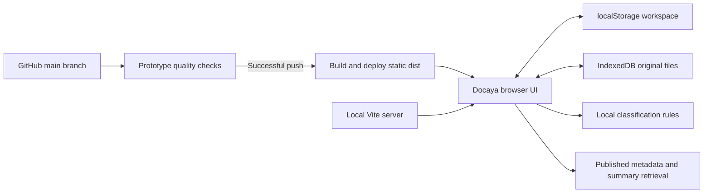

# Docaya architecture

Updated **6 September 2026**. This document distinguishes the current browser prototype from the connected-application design retained in the repository.

## Current prototype

`src/main.tsx` loads `src/prototype/PrototypeApp.tsx`, a React 18 and TypeScript application built with Vite. Local development and GitHub Pages run the same browser application. No API, database, cloud account, credentials or `.env` file is needed for its demonstration flows.

The default entry point does not load the earlier `src/App.tsx` application or depend on `server/`. Vite retains `/api` and `/health` proxy configuration for that earlier code, but the prototype does not use those services. Inter and Noto Sans Arabic are bundled with the static application, without external font-service requests.

## Source responsibilities

Paths below are relative to `src/prototype/`, except the repository-level test paths.

| Source                                                         | Responsibility                                                                                                      |
| -------------------------------------------------------------- | ------------------------------------------------------------------------------------------------------------------- |
| `PrototypeApp.tsx`                                             | Demo entry, navigation, persona, language, workspace state, overview, notifications and workshop.                   |
| `model.ts`                                                     | Seed records, capabilities, lifecycle transitions, governance, migration and export helpers.                        |
| `Registration.tsx`, `classification.ts`                        | Capture flow, local suggestions, field overrides and review confirmation.                                           |
| `ApprovalQueue.tsx`, `approval-queue.ts`, `approval-queue.css` | Pending and returned views, shared filtering/due ordering, full-width inbox and compact review rail.                |
| `RecordDetail.tsx`, `review-drawer.css`                        | Focused approval decisions and feedback, document previews/details, downloads and normal record-management actions. |
| `DocumentPreview.tsx`, `files.ts`                              | Preview selection, original-file persistence and integrity checks.                                                  |
| `Discovery.tsx`, `knowledge-search.ts`                         | Discovery, facets, cited retrieval and assistant behavior.                                                          |
| `Management.tsx`                                               | Staging/indexing, correspondence, records, administration, reporting and audit.                                     |
| `translations.ts`, `ui.tsx`                                    | Bilingual strings and shared interface components.                                                                  |
| `typography.css`                                               | Shared bilingual typography, readable UI sizes and responsive adjustments.                                          |
| `tests/prototype/`, `tests/unit/prototype-model.test.ts`       | Repository-level browser journeys and prototype model checks.                                                       |

## Browser storage

- **Workspace:** localStorage key `docaya-prototype-v1`, schema version 1. A separate seed version supports additive migration of synthetic MOI samples while preserving existing records and notes.
- **Original files:** IndexedDB database `docaya-prototype-files`, version 1, with a `files` store keyed by document ID.
- **Preferences and session:** language is saved locally; demo sign-in uses sessionStorage. Persona and active page reset on refresh. Assistant chat and ratings remain temporary component state.
- **Reset:** restores seeded workspace data and removes this prototype's saved originals and workshop notes. Export notes before resetting.

Each browser/origin is independent. GitHub Pages, localhost and different localhost ports do not share data. Storage can be lost through site-data clearing or browser eviction. This is not shared storage or a collaboration backend, and browser data is not included in the static build or a Git push.

## Approval workspace

`PrototypeApp.tsx` owns the approval view, search query and overdue filter. The `approval-queue.ts` helper filters accessible records to PendingApproval for **To review**, or Returned for the separate **Returned** view, then orders them by earliest due date. Invalid or missing dates sort last, and document ID breaks date ties. The same result supplies the inbox, compact rail and drawer navigation, so a next-document action stays within the displayed filter and order.

`ApprovalQueue.tsx` presents a full-width list before selection and a compact desktop rail during review. It shows actual due dates, overdue labels and separate pending/returned totals, with distinct empty-queue and no-matches states. Registration controls remain outside Approvals; approved records needing a publishing retry are handled in **Staging & publishing**.

In review mode, `RecordDetail.tsx` presents **Review**, **Details** and **Activity**, with a persistent preview and a focused decision area. One **Approve & sign** action approves the selected eligible step; a **Reviewing as** selector appears only when multiple parallel steps are eligible. **Return for changes** opens a required explanation and explicit **Confirm return** / **Cancel** controls. Optional delegation has a separate field. Model transitions continue to enforce approval order, permissions and return reasons.

After a decision, feedback keeps the document open. Partial approvals remain in the pending list and require **Review the remaining step** before another decision. Completed or returned records leave the pending list without being reinserted as selected items. **Next pending document** uses the same filtered queue; neither approval nor advancement is automatic. Normal record-management drawers retain their original overview, workflow, governance and activity sections. The assistant is unmounted while an approval drawer is open to keep the decision controls clear.

## Classification, retrieval and access

Classification uses deterministic rules over the filename and at most the first 12,000 characters of TXT files. It suggests metadata and displays a rationale during intake. Users can override values; the registration form requires confirmation before its submit action. Confirmation and rationale are not persisted on the document, and the separate saved-draft submit action validates required metadata without that confirmation flag. Classification does not extract PDF, Office or image contents, run OCR or call a model.

Discovery matches registered metadata and summaries from accessible records marked Published and indexed. An explicit demo batch sets indexing state. The assistant produces cited responses from those registered texts and recalculates source visibility when persona changes. It does not provide semantic full-document retrieval, live generation or conversational model memory.

Role and department rules demonstrate intended visibility and action availability in the client. They are not a security boundary: production authentication, authorization, audit attribution and file access must be enforced by trusted services. Publishing, signatures, notification delivery and correspondence are local simulations.

## Build and publication

`npm start -- --strictPort` starts Vite on localhost:5173. `npm run build` checks TypeScript and generates `dist/`; `npm run preview -- --host localhost --port 4173 --strictPort` serves a local production preview. See [README setup](../README.md#run-locally).

For automatic publication, the canonical repository is [hypermine2050/Docaya-Pro](https://github.com/hypermine2050/Docaya-Pro). [Prototype quality](../.github/workflows/ci.yml) checks a push to `main`; [Publish prototype to GitHub Pages](../.github/workflows/prototype-pages.yml) runs after success and checks out that run's exact `head_sha`. It builds with `DOCAYA_BASE_PATH=/Docaya-Pro/` and publishes only `dist/` to [https://hypermine2050.github.io/Docaya-Pro/](https://hypermine2050.github.io/Docaya-Pro/). Pull-request runs do not deploy.

The Pages workflow also supports manual dispatch using the selected revision (`github.sha`), which does not require the preceding quality result. Manual publishers should validate first. Browser state never enters the deployment artifact.

## Retained connected-application design

The following is the earlier enterprise design reference, not the backing architecture of the current prototype:

- A React browser client and versioned Node API, with Microsoft Entra ID access-token verification, claim-derived actor/tenant identity, capability authorization and tenant-scoped repository access. PostgreSQL 16 is the intended authoritative metadata store outside local development; SharePoint Online or an approved object store holds binaries.
- State changes pass through validation, authorization, a transaction boundary and a hash-chained audit append. The upload design covers session negotiation, ordered chunks, quarantine, integrity hashing, malware/DLP scanning, storage and metadata commits, and event/audit publication. Failed scans must not create a document record.
- Azure Container Apps uses VNet integration and private DNS for PostgreSQL, Search, Redis, Service Bus and ACR. Managed identity supports image pull and Azure/Graph access. Application Insights and Log Analytics provide correlated observability.

These design statements and retained implementation files do not establish a deployed production environment. Read the [enterprise specification](<Solution Doc/Docaya-DMS-Specification.md>), [API contract](api/openapi.json), [threat model](threat-model.md) and [operations runbook](runbooks/operations.md) as connected-application references. Use the [client demonstration guide](prototype-demo.md) for implemented prototype behavior and module-by-module boundaries.
