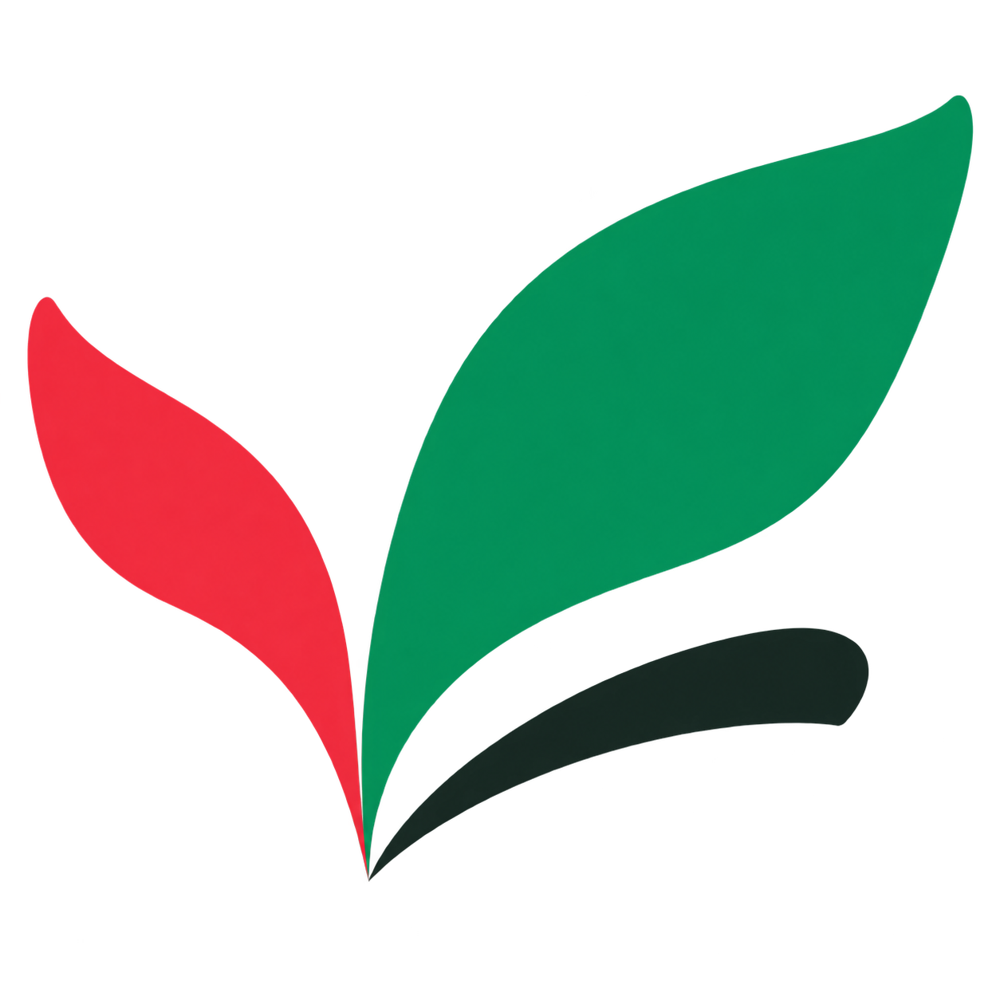
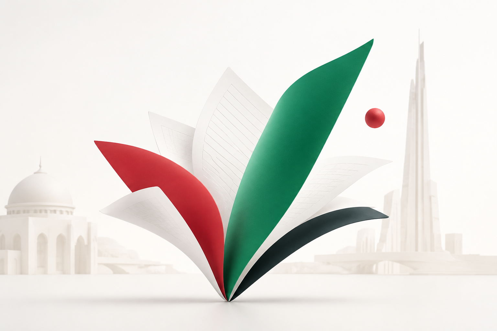

# Docaya brand assets

**Docaya · دوكايا · Document Management Intelligence / ذكاء إدارة الوثائق**

The current Docaya symbol uses three open, flowing page/ribbon forms: a tall green form at the upper right, a red form on the left and a dark lower arc. **Ask Docaya AI** uses a companion open-orbit symbol with a green ribbon, dark lower arc and small red node. The open forms suggest documents, movement and connected information without relying on a letter-shaped enclosure.

Green, red, near-black and white connect the identity to UAE colours while the application retains calm, readable document surfaces. The symbols, civic imagery and any decorative seal are prototype branding, not an official ministry mark or endorsement.

## Asset gallery

| Docaya                                                                                                                                                                                                         | Ask Docaya AI                                                                                                                                                                                                    |
| -------------------------------------------------------------------------------------------------------------------------------------------------------------------------------------------------------------- | ---------------------------------------------------------------------------------------------------------------------------------------------------------------------------------------------------------------- |
|  |  |

| File                                                             | Format and intended use                                                       |
| ---------------------------------------------------------------- | ----------------------------------------------------------------------------- |
| [docaya-mark-v2.png](../public/brand/docaya-mark-v2.png)         | 1254 × 1254 RGBA PNG with transparency; application identity and favicon.     |
| [ask-docaya-mark-v2.png](../public/brand/ask-docaya-mark-v2.png) | 1254 × 1254 RGBA PNG with transparency; assistant and AI feature identity.    |
| [docaya-welcome-v2.png](../public/brand/docaya-welcome-v2.png)   | 1536 × 1024 landscape PNG; open paper fan with very light civic architecture. |

Current assets are in [public/brand](../public/brand/). Files with the `-v2` suffix are the selected identity. The earlier unsuffixed PNGs remain as archived prior explorations and are not the current application marks. These deliverables are raster PNG files; vector source artwork is not included.

## Palette and usage

| Colour     | Design reference | Role                                           |
| ---------- | ---------------- | ---------------------------------------------- |
| Green      | `#008A58`        | Primary UAE-inspired brand colour.             |
| Red        | `#EE3344`        | Small accent and visual recognition.           |
| Near-black | `#142820`        | Structure, depth and dark contrast.            |
| White      | `#FFFFFF`        | Clear presentation surface and breathing room. |

These values describe the palette intent. The generated artwork includes shading, highlights and rendered colour variation; its pixels are not limited to these four exact values.

- Present the transparent symbols directly on light surfaces without a surrounding frame. Use a white plate only on dark backgrounds. Preserve their transparent margins and leave clear space around them.
- Keep the square logos at their original aspect ratio. Scale them proportionally without stretching, cropping or adding competing effects.
- Keep **Docaya / دوكايا** and assistant labels as native interface text using bundled **Inter** and **Noto Sans Arabic**. This preserves readable wordmarks, bilingual layout and accessibility at small sizes.
- Use the welcome illustration as supporting artwork. Keep essential headings and controls in the interface, with adequate contrast and spacing.

The shared [BrandMarks.tsx](../src/prototype/BrandMarks.tsx) components provide the Docaya and AI marks with configurable sizes and accessible labels. [brand.css](../src/prototype/brand.css) defines their unframed presentation on light surfaces and white plates on dark backgrounds. Asset URLs respect the application's Vite base path so they work locally and on GitHub Pages.

## In the application

The Docaya mark appears in the sidebar, sign-in header and browser favicon. The companion AI mark identifies discovery, assistant responses and the floating Ask Docaya button. The welcome illustration appears above the sign-in introduction.

## Generation provenance

The assets were created using the **built-in image-generation tool**. The [generation prompts](brand-prompts.md) record the exact prompts and selected files. The current symbols are transparent PNGs; the welcome scene is a landscape illustration. Earlier assets remain available as archived explorations.
