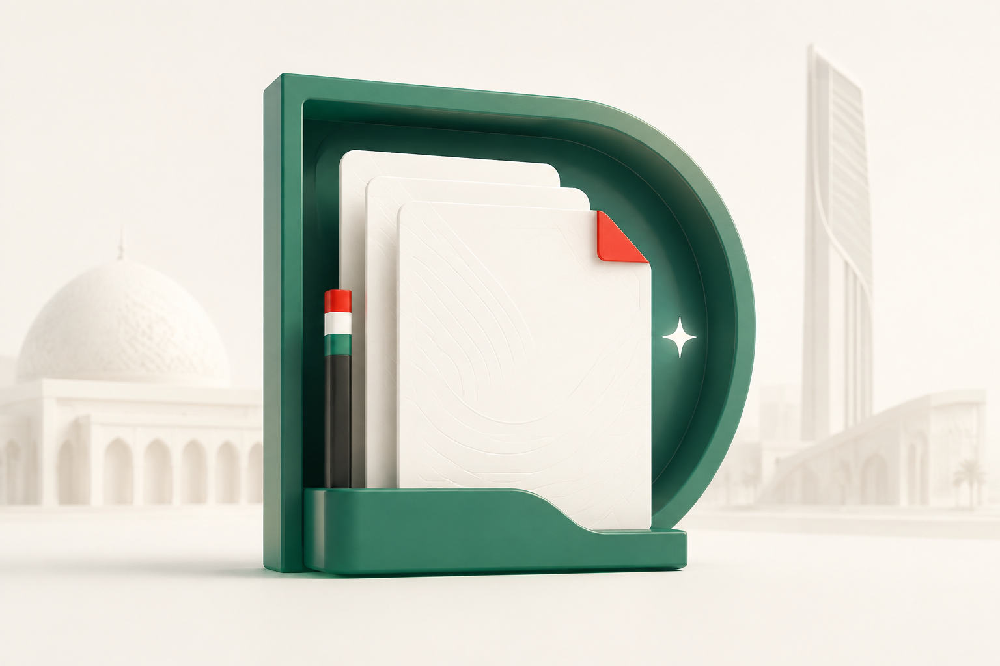
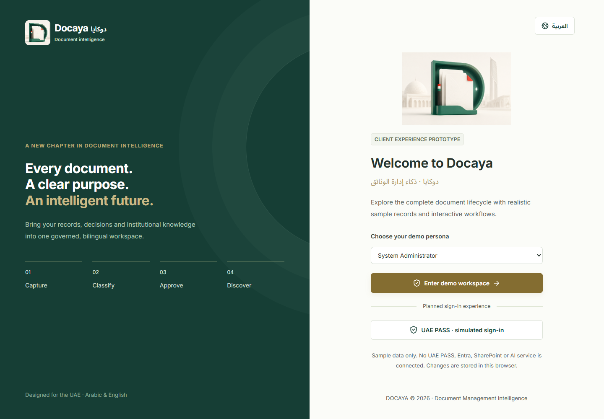
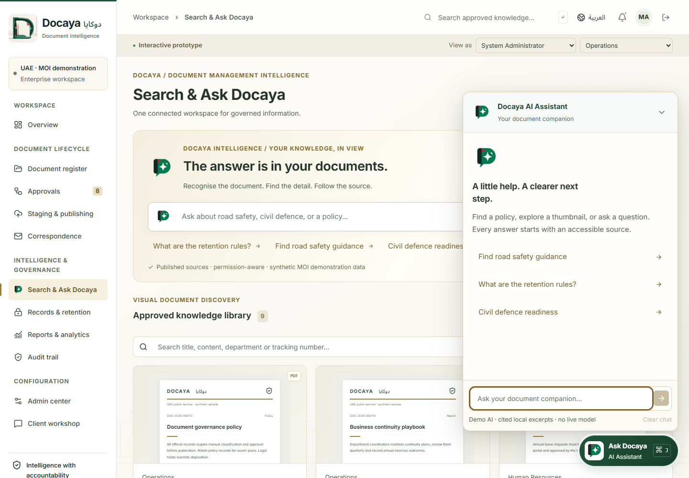

# Docaya brand assets

**Docaya · دوكايا · Document Management Intelligence / ذكاء إدارة الوثائق**

The user-selected identity uses two existing images. **Docaya** uses the three-dimensional emerald **D** folder with white paper sheets and a pale UAE skyline. **Ask Docaya AI** uses the emerald **D** speech bubble with a white sparkle, dark document spine and red folded corner. The selected files are reused without new artwork generation or image edits.

Green, red, near-black and white connect the identity to UAE colours while the application retains calm, readable document surfaces. The symbols, civic imagery and any decorative seal are prototype branding, not an official ministry mark or endorsement.

## Asset gallery

| Docaya                                                                                                                                                                                                                           | Ask Docaya AI                                                                                                                                                                               |
| -------------------------------------------------------------------------------------------------------------------------------------------------------------------------------------------------------------------------------- | ------------------------------------------------------------------------------------------------------------------------------------------------------------------------------------------- |
|  |  |

| File                                                       | Format and intended use                                                                             |
| ---------------------------------------------------------- | --------------------------------------------------------------------------------------------------- |
| [docaya-welcome.png](../public/brand/docaya-welcome.png)   | Unmodified 1536 × 1024 landscape PNG; main Docaya identity on login and in the top-left brand area. |
| [ask-docaya-mark.png](../public/brand/ask-docaya-mark.png) | 1254 × 1254 RGBA PNG with transparency; all Ask Docaya AI identity.                                 |

Current assets are in [public/brand](../public/brand/). The flat `docaya-mark.png` logo and all `-v2` files remain as archived explorations; they are not active application branding. These deliverables are raster PNG files; vector source artwork is not included.

## Palette and usage

| Colour     | Design reference | Role                                           |
| ---------- | ---------------- | ---------------------------------------------- |
| Green      | `#007A4D`        | Primary UAE-inspired brand colour.             |
| Red        | `#CE2031`        | Small accent and visual recognition.           |
| Near-black | `#152922`        | Structure, depth and dark contrast.            |
| White      | `#FFFFFF`        | Clear presentation surface and breathing room. |

These values describe the palette intent. The generated artwork includes shading, highlights and rendered colour variation; its pixels are not limited to these four exact values.

- Show the complete Docaya landscape artwork on login. In the top-left brand area, use its centre-focused square CSS presentation to retain the emerald D; the source file stays unchanged.
- Keep the AI logo square and preserve its transparent margins. Scale both assets proportionally without stretching or adding competing effects. Use a white plate for the transparent AI logo where a dark background would reduce its clarity.
- Keep **Docaya / دوكايا** and assistant labels as native interface text using bundled **Inter** and **Noto Sans Arabic**. This preserves readable wordmarks, bilingual layout and accessibility at small sizes.
- Keep essential headings and controls as native interface elements with adequate contrast and spacing around the main Docaya artwork.

The shared [BrandMarks.tsx](../src/prototype/BrandMarks.tsx) components provide the selected Docaya and AI images with configurable sizes and accessible labels. [brand.css](../src/prototype/brand.css) controls their presentation, including the compact centre-focused Docaya view. Asset URLs respect the application's Vite base path so they work locally and on GitHub Pages.

## In the application

The main Docaya landscape identity appears in full on login at 260 × 173 px and in a 60 × 60 px centre-focused presentation at the top-left of the application. The favicon and Apple touch icon reference the same original landscape file. The selected AI logo identifies discovery, assistant responses and the floating Ask Docaya button. Native **Docaya / دوكايا** labels remain beside the artwork where appropriate.

## Generation provenance

The two images were originally created using the **built-in image-generation tool**. The user subsequently selected these exact existing files for the current branding; this selection required no new generation or image edits. The [original generation prompts](brand-prompts.md) preserve the provenance of the selected AI logo and main Docaya landscape artwork. Other assets remain available as archived explorations.
