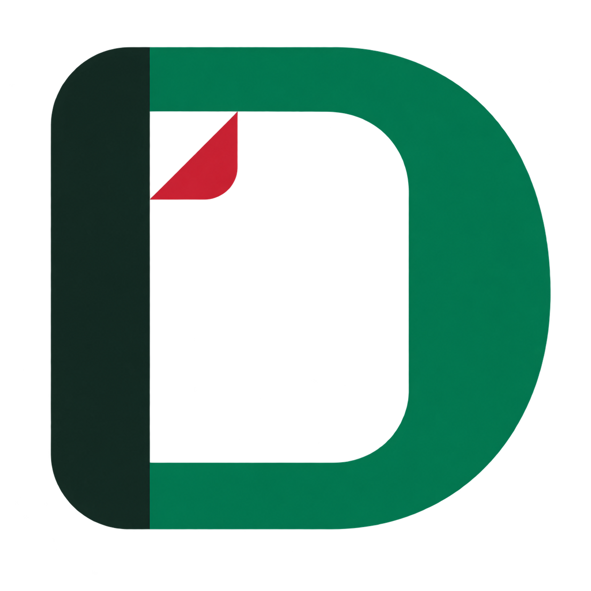

# Docaya brand assets

**Docaya · دوكايا · Document Management Intelligence / ذكاء إدارة الوثائق**

The prototype uses a document-inspired **D** mark for Docaya and a speech-bubble/spark mark for **Ask Docaya AI**. Green, red, near-black and white connect the identity to UAE colours while the application retains calm, readable document surfaces. The marks, landmark imagery and any decorative seal are original prototype branding, not an official ministry mark or endorsement.

## Asset gallery

| Docaya                                                                                                                                                                         | Ask Docaya AI                                                                                                                                                                                       |
| ------------------------------------------------------------------------------------------------------------------------------------------------------------------------------ | --------------------------------------------------------------------------------------------------------------------------------------------------------------------------------------------------- |
|  |  |

| File                                                       | Format and intended use                                                    |
| ---------------------------------------------------------- | -------------------------------------------------------------------------- |
| [docaya-mark.png](../public/brand/docaya-mark.png)         | 1254 × 1254 RGBA PNG with transparency; application identity and favicon.  |
| [ask-docaya-mark.png](../public/brand/ask-docaya-mark.png) | 1254 × 1254 RGBA PNG with transparency; assistant and AI feature identity. |
| [docaya-welcome.png](../public/brand/docaya-welcome.png)   | 1536 × 1024 RGB PNG; three-dimensional welcome illustration.               |

Original assets are in [public/brand](../public/brand/). These deliverables are raster PNG files; vector source artwork is not included.

## Palette and usage

| Colour     | Design reference | Role                                           |
| ---------- | ---------------- | ---------------------------------------------- |
| Green      | `#007A4D`        | Primary UAE-inspired brand colour.             |
| Red        | `#CE2031`        | Small accent and visual recognition.           |
| Near-black | `#152922`        | Structure, depth and dark contrast.            |
| White      | `#FFFFFF`        | Clear presentation surface and breathing room. |

These values describe the palette intent. The generated artwork includes shading, highlights and rendered colour variation; its pixels are not limited to these four exact values.

- Present the transparent logos on a white plate, especially against dark or illustrated backgrounds. Preserve their transparent margins and leave clear space around them.
- Keep the square logos at their original aspect ratio. Scale them proportionally without stretching, cropping or adding competing effects.
- Keep **Docaya / دوكايا** and assistant labels as native interface text using bundled **Inter** and **Noto Sans Arabic**. This preserves readable wordmarks, bilingual layout and accessibility at small sizes.
- Use the welcome illustration as supporting artwork. Keep essential headings and controls in the interface, with adequate contrast and spacing.

The shared [BrandMarks.tsx](../src/prototype/BrandMarks.tsx) components provide the Docaya and AI marks with configurable sizes and accessible labels. [brand.css](../src/prototype/brand.css) defines their presentation and white plates. Asset URLs respect the application's Vite base path so they work locally and on GitHub Pages.

## In the application

The Docaya mark appears in the sidebar, sign-in header and browser favicon. The companion AI mark identifies discovery, assistant responses and the floating Ask Docaya button. The welcome illustration appears above the sign-in introduction.

## Generation provenance

The assets were created using the **built-in image-generation tool**. The [final generation prompts](brand-prompts.md) record the exact prompt for each selected PNG. The source images were copied into `public/brand/` without pixel edits; both logo files have verified transparent alpha backgrounds.
