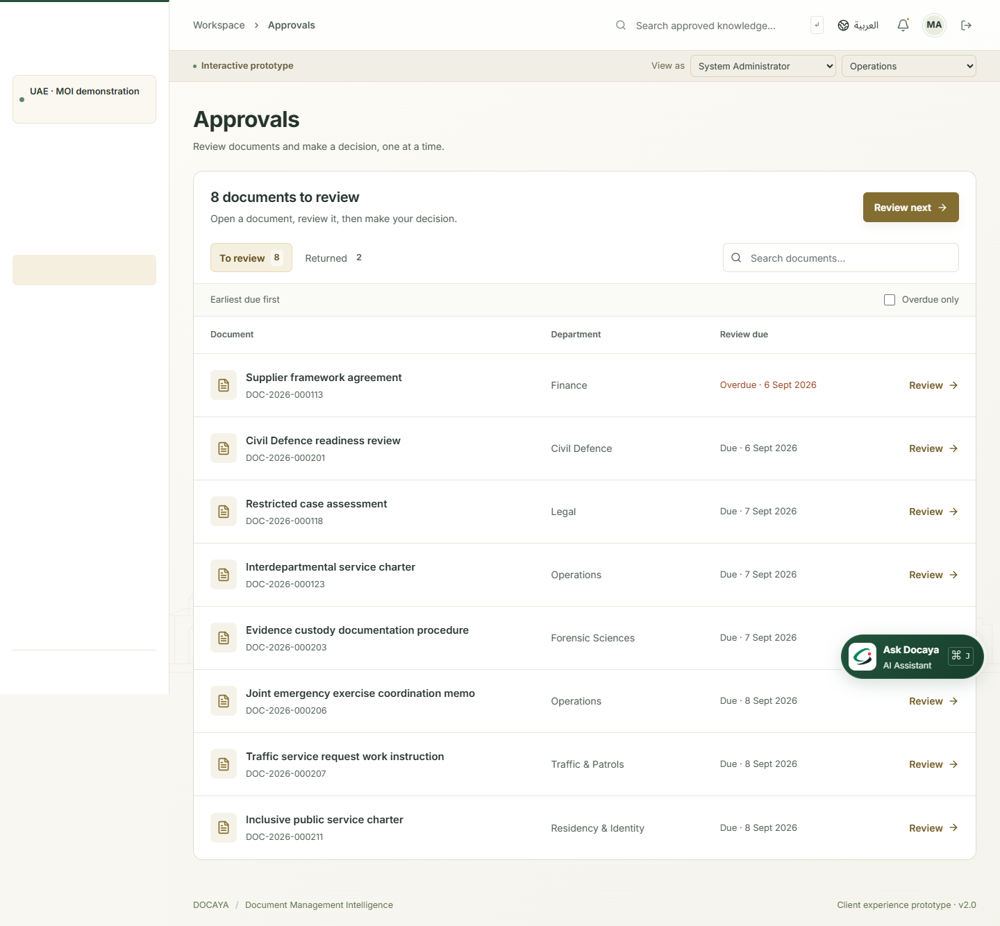
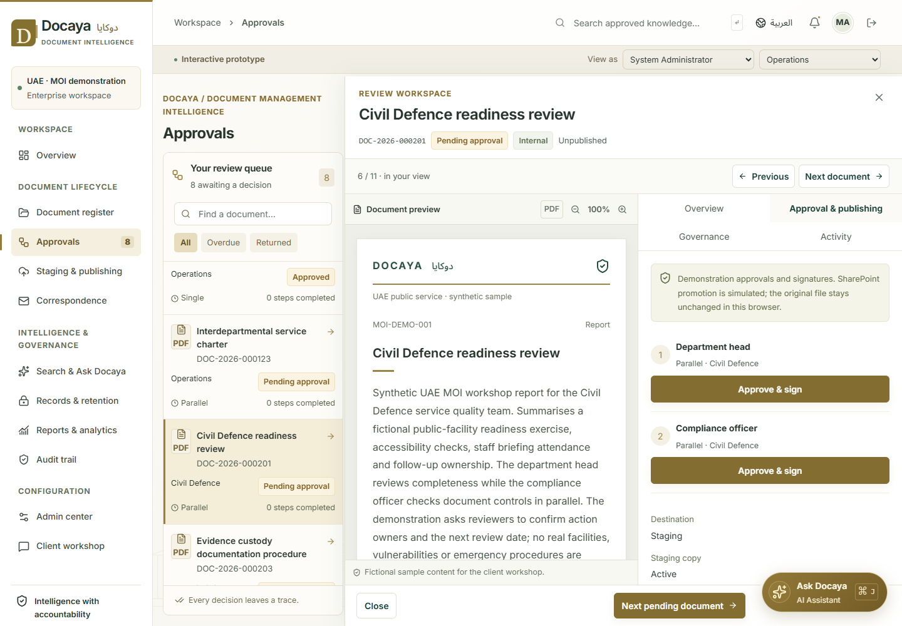
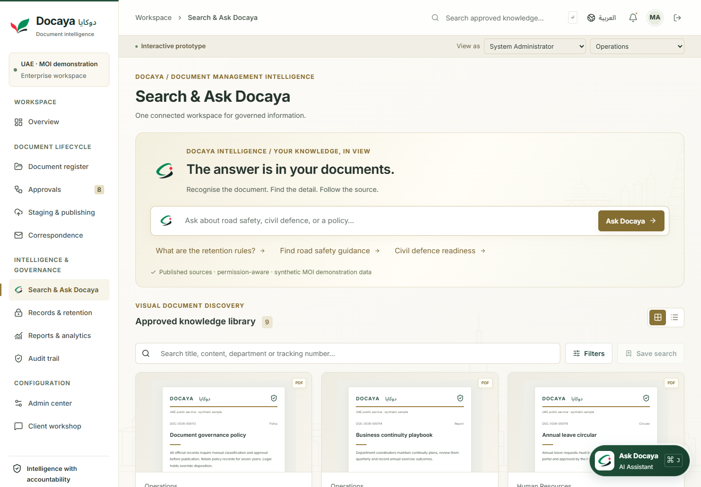

# Docaya client demonstration guide

**Docaya · دوكايا · Document Management Intelligence / ذكاء إدارة الوثائق**

Updated **6 September 2026** for the current prototype experience.

**[Open the hosted demo](https://hypermine2050.github.io/Docaya-Pro/)** · [Local setup](../README.md#run-locally) · [Architecture](architecture.md)

This guide describes what the browser prototype actually demonstrates. Records, people and MOI scenarios are synthetic. Authentication, cloud services, AI generation and digital signatures are simulated; this application does not establish production security or compliance.

## Before the meeting

1. Open the hosted demo or start the local site using the README instructions. No API, Azure account or credentials are required.
2. Select **Enter demo workspace** and **System Administrator** for the full demonstration.
3. Check English and Arabic layouts and open the floating assistant once to introduce it.
4. Use sample documents or non-sensitive demonstration files. Each browser/origin has its own workspace; your localhost records will not appear automatically on GitHub Pages.
5. Export existing **Client workshop** notes before using **Reset demo data**. Reset removes local changes, uploaded originals and workshop notes.

## Fifteen-minute walkthrough

| Time      | Screen and action                                                            | Client discussion                                                           |
| --------- | ---------------------------------------------------------------------------- | --------------------------------------------------------------------------- |
| 0–2 min   | Overview, document register and Arabic toggle                                | Terminology, information hierarchy, departments and bilingual expectations. |
| 2–5 min   | Register a sample; review suggestions, override a field and confirm          | Required metadata, classification rules and human responsibility.           |
| 5–8 min   | Approvals; scan pending work, review a document, approve or confirm a return | Due dates, clear decisions, remaining review steps and owner feedback.      |
| 8–10 min  | Run an indexing batch; browse thumbnails and ask Docaya                      | Search filters, source visibility and expected AI assistance.               |
| 10–13 min | Records & retention, Correspondence and reports                              | Holds, retention, action tracking and reporting expectations.               |
| 13–15 min | Client workshop; record priorities and export CSV                            | Confirm requirements, open questions and the next iteration.                |

## Register and classify a document

1. Select **Register document → Use a sample document**, or pick/drop a supported file. Samples include a traffic safety circular, civil defence procedure and evidence handling standard.
2. In **Capture**, inspect the filename, file-header check, duplicate result and SHA-256 fingerprint.
3. In **Classify**, review the suggested title, document class, department, sensitivity, approval pattern and summary, together with the rationale.
4. Override any suggestion to reflect the client's rules. Replacing the file during intake preserves fields that the user has overridden.
5. Continue to **Review & submit**, inspect the final values and select **I have reviewed the document and classification**. Editing a classification field clears the confirmation so the revised values must be reviewed again.
6. Select **Submit for approval** to enter the approval flow, or save a draft where offered.

Classification runs locally on filenames and up to the first **12,000 characters of TXT files**. The confidence label is a deterministic rule score, not measured model accuracy. PDF, Office and image contents are not extracted or OCR-processed. All suggestions remain subject to human review.

The registration form requires confirmation before its submit action. The confirmation flag and suggestion rationale are temporary intake state. A saved draft also has a direct submit action in record details, which validates required metadata without checking a persisted confirmation flag.

## Review documents without losing the queue

In every document list, the record currently open in the detail drawer stays highlighted with a tinted row and a green accent bar, so the selection remains visible beside the drawer.

Open **Approvals** to see a full-width list of documents awaiting approval. **To review** is the default; approved documents and records awaiting owner changes do not appear in it. Each row shows the document title, reference, department and actual due date, with overdue dates marked clearly. The earliest due document appears first.

- Use **Search approval queue** and **Overdue only** to narrow the list. **Review next** opens the first document in that view.
- Select **Returned** to see documents waiting for the owner to make changes. The pending and returned counts remain separate.
- An empty pending queue shows **All caught up**. An unsuccessful search shows **No matching documents** with **Clear filters**.
- Register new documents from **Document register**; the Approvals screen is dedicated to reviewing existing work.

Opening a document changes the wide-screen list to a compact queue beside the review drawer. The document preview stays beside its details, with no blurred backdrop. On narrow screens, preview and details stack; **Expand preview** gives the document more space while keeping decision controls available, and **Back to review** restores the details. Close the drawer to return to the queue. The floating assistant is hidden during approval review to keep the decision controls unobstructed.

1. Read **Review** for the owner, department and due date first, followed by a short document summary. Use **Read full summary** to expand it. The current reviewer appears beside the decision controls. **Details** contains document metadata and additional workflow information; **Activity** shows its history. The preview remains visible across all three tabs.
2. Select the single **Approve & sign** action, or **Return for changes**. Returning opens a focused required explanation field: enter the changes the owner should make, then select **Confirm return**. **Cancel** leaves the document unchanged.
3. Read the saved-decision feedback. A returned or fully approved record leaves **To review**, while its result remains open in the drawer. Select **Next pending document** to continue within the same searched/filtered queue, or return to the queue when no matching pending record remains. Previous/next navigation before a decision uses that same displayed order.
4. If another approval step is needed, the item remains pending and the feedback explains that it is incomplete. Choose **Review the remaining step** to make another decision on that document. The application does not automatically approve or move to another document.

Single, sequential, parallel and conditional patterns remain available. Sequential flows enforce order. Parallel flows show a **Reviewing as** selector only when more than one incomplete step is eligible, allowing either reviewer first; only the selected step is approved. Conditional Secret records route to senior director and compliance review. These are role-based demonstration steps, not real individual reviewer assignments.

Optional delegation is under **Need another reviewer?**, with its own delegate-name field. It is separate from the return explanation. Open a returned document through **Document register** to edit and resubmit it. Normal document-management drawers retain **Overview**, **Approval & publishing**, **Governance** and **Activity**; the three-tab presentation applies to the approval workspace.

Final approval transitions the document through the simulated publishing flow, preserving its original bytes and showing a version and destination. Download the unchanged original from **Details** to demonstrate format preservation. To show recovery, open the seeded **Facilities inspection report** in **Staging & publishing** and retry publication; administrator settings can also simulate a new publication failure. Approved documents needing a publication retry are handled there rather than in the pending approval list. The signature and destination are demonstration artifacts, not a trusted signature or a SharePoint transfer.

## Thumbnail discovery and the Docaya AI Assistant

Open **Search & Ask Docaya** to browse thumbnail cards or switch to a list. Filter by class, department and sensitivity, save a text query, and open a result to inspect its record and version.

Only accessible records that are **Published** and **indexed** appear in retrieval. After publishing a new record, use **Staging & publishing → Search indexing → Run demo batch**. Draft, returned, archived and inaccessible records are excluded.

Search matches registered titles, Arabic titles, document IDs, classes, summaries, departments and references. It does not perform semantic or full-content search over arbitrary uploaded files. Useful sample questions include:

- Find road safety awareness guidance.
- What do we have about community safety outreach?
- Find ministry document control guidance.

To retrieve the seeded civil defence or evidence handling documents, complete their approval flow and run the indexing batch first; those examples begin pending review.

The bottom-right **Ask Docaya · AI Assistant** opens a companion panel with cited answers, source thumbnails, suggested questions and response feedback. Use **Explore thumbnails** to move into discovery. `Ctrl+J` on Windows or `Cmd+J` on macOS toggles the assistant while it is mounted; `Escape` or minimize closes the panel. The assistant is unavailable while an approval or registration drawer is open; close the drawer to access it again.

Answers use local deterministic retrieval from registered sample text, with links to supporting records. There is no live LLM, OCR, embedding service or external AI call. Each question is retrieved independently; chat history is not conversational model memory. Changing persona recalculates source access and removes inaccessible sources from existing answers. Chat history and response ratings are temporary component state.

## File and preview behavior

| File or record                      | Preview and download                                                                                          |
| ----------------------------------- | ------------------------------------------------------------------------------------------------------------- |
| Seeded synthetic record             | Clearly marked sample page; download provides sample TXT rather than an invented original PDF or Office file. |
| Uploaded TXT                        | Preview of up to the first 200 KB; unchanged original remains downloadable.                                   |
| Browser-supported image             | Original image preview and original download.                                                                 |
| Uploaded PDF                        | Browser PDF viewer in the full preview where supported; thumbnail uses a cover, not rendered page extraction. |
| DOCX, XLSX or PPTX                  | Cover with file information and original download; no Office renderer or content extraction.                  |
| TIFF or unsupported image rendering | Preview depends on browser support; use the fallback and original download when it cannot render.             |

Accepted formats are **PDF, DOCX, XLSX, PPTX, PNG, JPEG, TIFF and TXT**, with a **20 MB per-file** browser limit. SHA-256, basic signature/header checks and duplicate detection support the capture demonstration. They do not constitute malware or DLP scanning. Uploaded bytes are preserved in IndexedDB.

## Readability and UAE visual design

The selected main Docaya identity is the three-dimensional emerald **D** folder with white paper sheets and a pale UAE skyline. Login shows the complete landscape image; the top-left brand area uses a centre-focused square CSS presentation of the same unmodified file. All **Ask Docaya AI** features use the selected emerald **D** speech-bubble logo with its white sparkle. These are the user's chosen existing images, with no new artwork generation for this selection.

The branding draws on UAE green, red, near-black and white; the document workspace retains warm ivory, muted gold and a faint decorative UAE-inspired skyline. The overview hero and dark banners share the same deep emerald green as the login page for a consistent, cooler palette throughout. Native English/Arabic wordmarks preserve readability. See [Brand assets and usage](branding.md) for the selected PNG pair and palette. The flat Docaya logo and all `-v2` assets are retained as archived explorations, not active branding.

The artwork and decorative seal are not official ministry emblems. Synthetic scenarios cover Traffic & Patrols, Civil Defence, Forensic Sciences, Residency & Identity, and Strategy & Governance.

| Element                    | Current design                                                                                     |
| -------------------------- | -------------------------------------------------------------------------------------------------- |
| English body               | Bundled Inter, 15 px base size.                                                                    |
| Arabic body                | Bundled Noto Sans Arabic, 16 px base size and right-to-left layout.                                |
| Task labels and table text | 14 px with clearer contrast and spacing.                                                           |
| Standard captions          | 12.5 px; miniature document pages and compact brand/file-format marks use smaller decorative text. |
| Small-screen forms         | 16 px inputs and primary buttons at least 44 px high.                                              |
| Narrow registration drawer | Single-column fields below 470 px of form-container width.                                         |

Fonts are bundled with the application, so loading the UI does not require an external font service. Drawers use readable surfaces without background blur, and review tabs wrap to keep labels available at narrower widths.

## Governance, administration and workshop actions

- **Records & retention:** apply a hold with a reference and show that archive, disposition and revision actions are blocked. Release with a reason, declare or archive a record, and demonstrate confirmed simulated disposition while registry history remains.
- **Correspondence:** register incoming/outgoing items, memos or circulars; record replies, forward to a department, close/reopen an action and acknowledge reading. These actions update local state and do not send external messages.
- **Personas:** switch to Viewer, select a department and compare visibility. Document registration, approval and governance controls are unavailable to Viewer. Browser role controls demonstrate intended behavior; they are not a server security boundary.
- **Admin center:** add a class, configure routing root, default department, SLA, retention, cleanup, indexing cadence and notification preferences. Inspect the capability matrix and simulated integration cards.
- **Reports and activity:** review state-derived metrics, department filters, CSV export, browser print/PDF and local event history.
- **Client workshop:** explore M1–M15, capture expectations and priorities, and export notes to CSV before a reset.

## M1–M15 coverage and boundaries

| Module            | Interactive prototype                                                                                                              | Production / future work                                                                         |
| ----------------- | ---------------------------------------------------------------------------------------------------------------------------------- | ------------------------------------------------------------------------------------------------ |
| M1 Capture        | Picker/drop, samples, metadata, SHA-256, header checks, duplicate detection and drafts; 20 MB per file.                            | 5 GB resumable/bulk uploads, malware/DLP, scan/email capture and cloud staging.                  |
| M2 Classification | Local suggestions, rationale, overrides and explicit confirmation in registration.                                                 | Per-class schema designer, advanced rules and model-based content extraction.                    |
| M3 Workflow       | Pending-only queue, due-date ordering, filtered navigation, focused decisions, required return reasons and four approval patterns. | Real reviewer assignments, automated escalation, quorum configuration and email/Teams decisions. |
| M4 Publishing     | Approval-driven transition, original bytes, versions, supersession, failure and retry.                                             | Graph transfer, durable orchestration, SharePoint IDs/URLs and transactional idempotency.        |
| M5 Staging        | Active/retained/purged indicators, cleanup preference and returned/failed items.                                                   | Actual storage cleanup and abandoned-draft scheduler; current cleanup is a state simulation.     |
| M6 RAG            | Explicit batch, published-only index flag and permission-aware cited sample retrieval.                                             | OCR, embeddings, hybrid Azure search, live generation and scheduled batches.                     |
| M7 Notifications  | Local lifecycle alerts, read/unread, mark-all and locked security preference.                                                      | SignalR, email, Teams, push, quiet-hours scheduling and durable delivery.                        |
| M8 Correspondence | Registration, references, reply thread, assignment, due dates, close/reopen and acknowledgement.                                   | External transport, attachment links, distribution lists and templates.                          |
| M9 Records        | Holds/release reasons, declaration, archive, simulated disposition and due filters.                                                | Event-based policies, archive tiers and actual defensible deletion.                              |
| M10 Discovery     | Thumbnail/list views, facets, saved queries, cited assistant and English/Arabic matching.                                          | Hybrid ranking, date/owner facets and shared smart views.                                        |
| M11 Identity      | Demo entry, UAE PASS simulation and integration design.                                                                            | UAE PASS federation, Entra OIDC/PKCE, MFA/step-up and service identity.                          |
| M12 Access        | Demo role/department rules, capability matrix and restricted document controls for Viewer.                                         | Server-enforced RBAC/ABAC, SharePoint ACLs and named groups.                                     |
| M13 Admin         | Classes, routing root, default department, SLA, retention, cleanup and notification preferences.                                   | Full workflow/schema/routing designers and security policy editors.                              |
| M14 Reports       | State-derived metrics, department filters, CSV and browser print/PDF.                                                              | Historical cycle times, scheduled reports, native XLSX, Power BI and anomalies.                  |
| M15 Audit         | Local actor/role/action/object/time/event IDs, CSV and demo signature certificate.                                                 | Trusted attribution, hash-chained SQL, immutable storage and legally valid signatures.           |

## Persistence and reset

| Data                                                        | Behavior                                                                        |
| ----------------------------------------------------------- | ------------------------------------------------------------------------------- |
| Records, settings, audit, saved searches and workshop notes | Stored in localStorage and preserved across refresh in the same browser/origin. |
| Uploaded originals                                          | Stored separately in IndexedDB, keyed to their document record.                 |
| Language preference                                         | Persists locally.                                                               |
| Demo sign-in                                                | Stored for the browser session.                                                 |
| Active page and persona                                     | Reset on refresh to Overview and System Administrator.                          |
| Assistant chat and response ratings                         | Temporary component state; not part of the saved workspace.                     |

Sample-data migration appends missing MOI examples while preserving existing records and workshop notes. Clearing site data, resetting the demo, or browser storage eviction can remove local work. Export workshop notes and retain any original files you need outside the demonstration.

Each localhost port and the hosted site is a separate origin. There is no shared collaboration, cross-device sync or real authorization. Git pushes and static deployments publish application files only; they do not upload or synchronize browser records, originals or notes.

## Architecture and validation

`src/main.tsx` loads `src/prototype/PrototypeApp.tsx`. The current prototype has no backend dependency. See [Architecture](architecture.md) for source responsibilities, storage and the retained connected-application design.

Validation includes build, lint, unit/integration checks and prototype browser journeys. Approval scenarios cover pending-only counts, due-date ordering, filtered navigation, required return reasons, partial parallel approvals and Arabic mobile decision controls. Manual browser review also covers desktop/mobile English and Arabic screens, font loading, registration and search, with automated accessibility scans for selected states. These are prototype checks, not a production accessibility or compliance certification. Reproducible commands are in the [README](../README.md#validate-changes).

## Publishing the client demo

The canonical repository is **[hypermine2050/Docaya-Pro](https://github.com/hypermine2050/Docaya-Pro)** and the hosted URL is **[https://hypermine2050.github.io/Docaya-Pro/](https://hypermine2050.github.io/Docaya-Pro/)**. Push to `main`: **Prototype quality** runs, then **Publish prototype to GitHub Pages** deploys the exact tested commit after a successful push run. Pull-request runs do not publish. Manual dispatch builds the selected revision without requiring that preceding quality result; validate before using it.

Pages builds with `/Docaya-Pro/` as the asset base and uploads only `dist/`. Each client starts with an independent sample workspace. See the [publishing instructions](../README.md#publish-to-github-pages).
